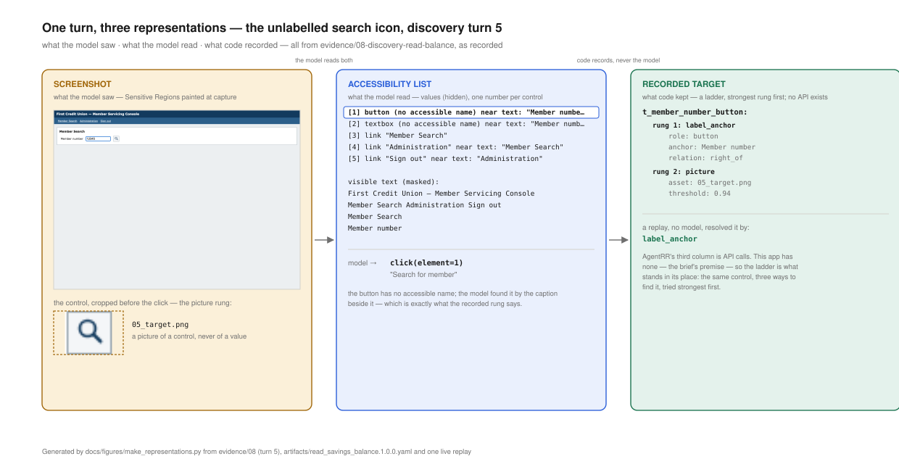

# bank_app_agent

An LLM discovers how a task is done in a legacy bank application **once**, against a
non-production copy. That run is compiled into a reviewable **Artifact**. Thereafter the
**Replay Engine** executes it with given inputs and **no model in the decision loop** — the
only way a capability runs in production.

Write-up: **[REPORT.md](./REPORT.md)** · worked runs: **[evidence/](./evidence/)** ·
language: [CONTEXT.md](./docs/CONTEXT.md) · decisions: [docs/adr](./docs/adr)

---

## Setup

Python 3.11 or newer. The macOS system Python is 3.9, which will not install this.

```bash
pip install -r requirements.txt
python -m playwright install chromium
```

Start the demo bank — two instances, the same product configured as two institutions:

```bash
python -m fake_bank.app &                        # First Credit Union  :5001
SKIN=bank2 PORT=5002 python -m fake_bank.app &   # Lakeside Savings    :5002
```

Open <http://localhost:5001> and sign in as `svc_officer` / `officer-pw` to see what the
automation is working against. `GET /reset` restores the seed data, and every tool below
calls it first, so the walkthrough is repeatable in any order.

No API key is needed for steps 1–7. Step 8 needs one: export `ANTHROPIC_API_KEY`, or put
`ANTHROPIC_API_KEY=...` in a `.env` file in this folder (gitignored; `tools.discovery` reads it).

**In five minutes**, with both instances up:

```bash
python -m tools.replay 12345 --capability member.read_savings_balance   # one approved capability, no model: succeeded
python -m tools.replay 99999 --capability member.read_savings_balance   # the same Artifact meets "No records found": business_outcome
python -m tools.replay 12345 bank_b --capability member.open_sub_account   # a Tenant that grants no such Role: refused, nothing touched
python -m pytest -q                                                     # 216 tests against the demo app, no model
```

Each is explained in the walkthrough below.

---

## The target application

`fake_bank/` is a deliberately hostile stand-in for a legacy member-servicing console:
server-rendered with full page reloads, nested table layout, no ids or test ids,
session-scoped generated control names, an unlabelled icon button, duplicate "Open" text,
and the balances inside an iframe.

Two service accounts: `svc_read` / `read-only-pw` (cannot open accounts — the application
itself refuses) and `svc_officer` / `officer-pw`.

The member number selects the scenario:

| Member | Behaviour | Condition it exercises |
|---|---|---|
| 12345 | normal | success |
| 99999 | "No records found" | Business Outcome |
| 22222 | "not authorized to view" | Business Outcome |
| 54321 | system notice once, then normal | Recoverable (interstitial) |
| 77777 | application error once, then normal | Recoverable (transient) |
| 88888 | session expires | Recoverable — the system signs in again |
| 66666 | balances panel takes 3s | Recoverable (slow load) |
| 44444 | flagged: needs a supervisor ID + PIN | Escalate — automation holds no such credential |
| 33333 | already holds 3 sub-accounts | held out: Unknown State on commit |

---

## Walkthrough

### 1. Watch one capability run

```bash
python -m tools.replay --list                 # the catalog: every capability, and whether it is approved
python -m tools.replay 12345 --headed --attended     # asks which capability when more than one is approved
python -m tools.replay 12345 --headed --attended --slowmo 2000    # slower, to follow along
python -m tools.replay 12345 --headed --attended --capability member.open_sub_account
python -m tools.replay 12345 --headed --capability member.read_savings_balance   # reads only: needs nobody
```

`--attended` means an Operator is on shift: you. A capability that commits something pauses
before the click that commits and asks you at this terminal (`--console` sends the question
to the Operator console instead). Without `--attended` such a capability is **Refused** before a
browser opens: no person, no commit. A read-only capability needs nobody.

Which artifact runs is the Capability Store's answer: the highest **approved** version of the
capability id — a draft never replays. A browser opens and drives itself. Drop `--headed` to run it headless in about 3 seconds.
Every switch has an environment-variable twin for scripts: `HEADED=1`, `ATTENDED=1`, `CAPABILITY=…`.
The capability is `member.open_sub_account`: sign in → search → read the savings balance out
of the iframe → open a sub-account → confirm → read back the new account number.

Each line is one Transition, and **`rung=` is which way of finding the control worked**:

```
  s1_login         -> s2_user_id_entered type   t_user_id                secret:login_username    rung=label_anchor risk=safe
  s2_user_id_entered -> s3_password_entered type   t_password               secret:login_password    rung=label_anchor risk=safe
  s3_password_entered -> s4_search        click  t_sign_in                                         rung=role_name risk=safe
  s4_search        -> s5_member_number_entered type   t_member_number          {{member_number}}        rung=label_anchor risk=safe
  s5_member_number_entered -> s7_members_id    click  t_member_number_button                            rung=label_anchor risk=safe
  s7_members_id    -> s8_savings_balance_read read   t_savings_balance                                 rung=label_anchor risk=safe
  ...
  s12_members_id   -> s13_members_id   click  t_continue                                        rung=role_name risk=consequential
  s13_members_id   -> s14_new_account_number_read read   t_new_account_number                              rung=label_anchor risk=safe

RESULT  succeeded
OUTPUTS {'savings_balance': '$4210.00', 'new_account_number': 'SA-2001'}
TIME    3.4s     evidence: runs/run_a7fe58ff
```

Three things to notice. The password was never a literal — `secret:login_username` is a
reference resolved at the keystroke. `t_member_number_button` is the **unlabelled icon
button**: rung 1 (accessibility name) finds nothing, so rung 2 finds it by the caption
beside it, and the log records which rung won. And exactly one Transition is
`consequential` — the click that actually opens the account.



*The unlabelled search icon three ways: the masked screenshot, the accessibility list
(no name, so a text-only agent cannot see it), and the recorded Target, found by the
caption beside it.*

### 2. The conditions, one command each

Every one of these is the *same approved Artifact* meeting a different screen. Name it
once, so no command stops to ask which capability:

```bash
export CAPABILITY=member.open_sub_account
python -m tools.replay 99999 --attended   # Business Outcome — the app's legitimate answer
python -m tools.replay 54321 --attended   # Recoverable — dismisses an interstitial, carries on
python -m tools.replay 88888 --attended   # Recoverable — session expires, the system signs in again
python -m tools.replay 44444 --attended --wait 5   # Escalate — nobody answers in 5 s, so it stops
python -m tools.replay 33333 --attended   # the held-out condition, on purpose
python -m tools.replay 12345              # unattended: Refused, a person is required to commit
```

What you should see:

| Command | Result | Why |
|---|---|---|
| `99999` | `business_outcome · MEMBER_NOT_FOUND` | not an error: the answer, with `retry_same_inputs: never` and a hint for the caller |
| `54321` | `succeeded` | a Watcher recognised the notice, dismissed it, re-checked, continued |
| `88888` | `succeeded` | the automation holds the service account, so it re-authenticates itself |
| `44444` | `failed · escalation_timeout` | a supervisor's own ID and PIN — no Role holds those, and nobody took the session within 5 s |
| `33333` | `failed · unknown_state` | no Watcher covers "maximum accounts reached"; it refuses to guess |

`33333` is the point of the design: the Artifact has **never seen** this screen. It does not
guess. It runs the Verification Check, confirms the account was *not* created, and fails with
evidence.

### 3. A person takes the live session

`44444` is flagged, and only a supervisor can clear it. Run it attended:

```bash
python -m tools.replay 44444 --headed --attended
```

The run pauses and hands over the browser it was already using. In a second terminal:

```bash
python -m tools.operator
```

```
  INTERVENTION  run_bd7f80f8
  capability    member.open_sub_account
  stopped at    s5_member_number_entered  (w_approval_required)
  because       This member is flagged; only a supervisor may clear it.
  the session   http://127.0.0.1:5001/members
```

Now act **in the browser window that is already open** — supervisor `sup_ramirez`, PIN
`4821`, then Acknowledge. You do not need to press Resume: the run watches the screen, sees
the blocking condition gone, re-checks which Checkpoint holds, and carries on to
`succeeded`. `python -m tools.operator abort` stops it instead, which returns `aborted` —
a decision, not a failure.

There is also a browser console for the same thing:

```bash
python -m tools.operator.web     # http://127.0.0.1:5010
```

The automation never types the supervisor PIN, and it is never written to the trail — only
*that* a person acted, who they were, and whether the page changed.

### 4. Safety refuses before the browser opens

```bash
python -m tools.replay 12345 bank_b --capability member.open_sub_account
```

```
RESULT  refused · tenant 'bank_b' does not grant role 'account_opener'
```

Nothing was touched. Permissions are **Baseline ∩ Role ∩ Tenant grant ∩ Needs**, a true
intersection — each layer may narrow what the one above allows, none may widen it. The same
front door refuses an undeclared origin, an unapproved Artifact, a capability that commits
when nobody is on shift, and an input that fails its Contract:

```bash
python - <<'PY'
from cua.replay.engine import RunContext, replay
from cua.governance.store import load_capability, origin_for

art = load_capability("member.open_sub_account")
here = origin_for("bank_a", "demo-core-servicing")

print(replay(art, {"member_number": "12", "account_type": "savings", "nickname": "x"},
             RunContext(origin=here)))
print(replay(art, {"member_number": "12345", "account_type": "savings", "nickname": "x"},
             RunContext(origin="http://127.0.0.1:9999", tenant="bank_a")))
PY
```

```
refused · input 'member_number' does not match ^[0-9]{5}$
refused · origin 'http://127.0.0.1:9999' is not an instance tenant 'bank_a' declares
```

What each of the four layers contributes, by example:

- **Baseline** ([config/baseline.yaml](./config/baseline.yaml)), the agent vendor's floor.
  Four actions only, so no run on any Tenant can download a file or run a script; no
  secret reaches a model; discovery never runs against production; a Consequential Action
  never runs without an Operator's approval; a route with `wire`, `transfer` or `payment`
  in it is refused, because this version of the product does not move money.
- **Role** ([config/roles/](./config/roles/)), one job's access. `balance_reader` may
  type, click and read on `/login`, `/search` and `/members/*`, signed in as `svc_read`;
  a click that lands on `/admin` is refused at that action, whatever any Tenant says.
- **Tenant Policy** ([config/policies/](./config/policies/)), the institution's grant.
  `bank_b` grants `balance_reader` but not `account_opener`; a Tenant may cut a page
  from a Role for its own instance but cannot add one, because its file can only narrow.
- **Needs**, declared in the Artifact from what discovery used, and required to fit inside
  its Role: `read_savings_balance` used three pages, three actions and the two login
  secrets, all inside `balance_reader`.

### 5. One Artifact, two institutions

Lakeside Savings runs the same vendor product with renamed controls and the search icon
moved. The same approved Artifact, unchanged. It commits, so it runs attended: a scripted
Operator approves the commit and declines to take over a screen it does not recognise.

```bash
python -m tools.demos.b2
```

```
1. First Credit Union — the institution it was recorded on
   succeeded

2. Lakeside Savings — same product, renamed controls, no Overlay
   aborted · stopped by operator:callback · at s3_password_entered
   handed to the Operator because: no Watcher recognises this screen

3. Lakeside Savings — the same artifact, with a 20-line Overlay
   succeeded   savings_balance=$4210.00 account=SA-2001
   patched: t_continue, t_member_number, t_member_number_button, t_open

4. An Overlay that tries to change behaviour
   refused · overlay rejected: [overlay_changes_behaviour] transitions: an overlay may not change 'transitions'
```

Step 4 is the one that matters: a Tenant Overlay may change how things **look** — origin,
control labels, timeouts — and is refused outright if it tries to change what the capability
**does**. A cosmetic per-tenant file cannot alter a reviewed flow.

### 6. Why the targeting survives a hostile app

```bash
python -m tools.demos.b1
```

Prints the accessibility view of the search control (it has no name at all), then the ladder
recorded for it, then a replay showing which rung actually resolved each Target. The replay
runs attended, with the same scripted Operator approving the commit. A rising
rate of fallback matches for a tenant is the signal that their app has drifted —
see [docs/targeting.md](./docs/targeting.md).

### 7. Read any run afterwards

```bash
python -m tools.inspect.show_run                                  # your most recent run
python -m tools.inspect.show_run evidence/05-replay-escalation-handoff   # a committed one
```

Any run folder works: the `evidence:` line at the end of every replay names one under
`runs/`.

Every run leaves an append-only redacted trail: each policy decision, each action, which rung
matched, every Watcher that fired, and a screenshot on failure with the declared Sensitive
Regions already painted black — look at
[`evidence/06-replay-unknown-state/screen_1.png`](./evidence/06-replay-unknown-state/) and
you will see the member's name and date of birth blacked out while the balances, which are
the answer, remain.

Eight runs are committed in **[evidence/](./evidence/)** with a guide to reading them. The
five replays regenerate from the current code with `python -m tools.replay.make_evidence`.

### 8. Discovery — where the Artifact came from

This is the half with a model in it, and it only ever runs against a non-production
environment (the code refuses otherwise). It needs the API key from Setup.

```bash
python -m tools.start
```

```
What do you want to do today?: look up a member and read their savings balance

  capability  member.read_savings_balance
  role        balance_reader — View member information and balances.
  goal        Look up member {member_number} and read their current savings balance
  input       member_number      string  ^[0-9]{5}$  (sensitive)
  returns     succeeded         -> outputs: savings_balance  money
              business_outcome  -> MEMBER_NOT_FOUND · NOT_AUTHORIZED · NO_SAVINGS_ACCOUNT

Approve this contract? [Y/n/e]  y
```

Two reviews, one sitting. First the model proposes the Contract and the narrowest Role
from the goal, and the Reviewer approves it before any run. Then the browser opens: each
turn the model gets a masked accessibility list and a screenshot and proposes **one
action**; code checks it against policy and performs it. It never sees a password or a
value outside a declared Readable Region. When the goal is reached the Recorder compiles a
draft Artifact and the **second review** starts in the same terminal. Every click arrives
Consequential and only a person downgrades it; every Outcome Code the Contract promises
needs a Watcher that can recognise it. After the happy path, discovery probes each outcome
with the input the Discovery Request names for it (`outcome_examples`: 99999 for
MEMBER_NOT_FOUND, 22222 for NOT_AUTHORIZED); the model reports the outcome and quotes the
screen, code checks the quote was on that screen, and the review offers it for a yes. An
outcome with no probe borrows a Watcher from another approved capability, or is dropped. The answers are a decisions file, applied mechanically, and
approval is refused unless the result lints clean **and** verify-replays, with no model,
on a member discovery never saw. To redo that review from a saved run, give it the
`runs/disc_…` folder your discovery printed, or the committed one:

```bash
python -m tools.start --review evidence/01-discovery-goal-reached
```

**Without a key**, the same chain runs from a committed discovery run:

```bash
python -m tools.inspect.show_run evidence/01-discovery-goal-reached   # what the model saw and asked for
python -m tools.authoring.record  evidence/01-discovery-goal-reached   # compile the draft + suggestions
python -m tools.authoring.approve evidence/01-discovery-goal-reached   # apply decisions, verify, approve
```

`approve` rewrites `artifacts/open_sub_account.1.0.0.yaml` in place and is idempotent: it
reproduces the committed artifact byte for byte, which is why step 9 still passes
afterwards.

The full transcript of both reviews, the flag-driven form for scripts, what happens to a
goal that strays outside its Role, and the redaction chain the model sits behind are in
[docs/discovery.md](./docs/discovery.md).

### 9. The tests

```bash
python -m pytest -q          # 216 passing, ~10 minutes
```

Nothing is mocked: the demo app is the fixture, and each test reads as "replay for 99999 and
expect `MEMBER_NOT_FOUND`". Some assert structure rather than behaviour — that replay cannot
transitively reach a model SDK, that only one module imports Playwright, that the engine
cannot reach past the acting interface of the Surface.

> The suite starts its own demo apps on ports 5099 and 5100 and refuses to run if either is
> already taken — a shared server would have its state reset by another session mid-test.
> If it stops at startup, clear the port: `pkill -f fake_bank.app`.

---

## Error handling reference

Every runtime condition and what the engine does about it, then where each Watcher lives
and how it was learnt, are Figures S4 and S5 of
[REPORT_SUPPLEMENT.md](./docs/REPORT_SUPPLEMENT.md). The short form: every surprise becomes
one of four Conditions, and the test is who can act, the system alone within a budget, a
person during the run, or nobody in time. Vocabulary in [CONTEXT.md](./docs/CONTEXT.md);
budgets in [docs/error-taxonomy.md](./docs/error-taxonomy.md).

---

## Code organization

Three top-level packages, one direction of dependency. `cua/` is the system and is a
library: nothing in it imports from `tools/`, and nothing in it knows about the demo app.
`tools/` are entry points that wire `cua/` together, one package per stage of a
capability's life. `fake_bank/` is the target. Everything else is data the code reads or
writes. Every boundary named below is asserted by
[`tests/unit/test_boundaries.py`](./tests/unit/test_boundaries.py), which walks the import
graph, so a file that moves cannot slip out from under a rule.

```
cua/                       the system (a library; imports nothing from tools/)
├── domain/                pure: the Artifact schema, the result shape, the rules. No I/O.
├── governance/            what a Reviewer, a Role author or a Tenant owns, read from config/
├── evidence/              the trail: one Redactor in front of one writer, and a reader
├── surface/               the browser — the only package that imports Playwright
├── replay/                production: execute an approved Artifact, no model in the loop
├── authoring/             draft → approved, with no browser and no model
├── discovery/             the one package where a model is in the loop
├── settings.py            where the data lives (CUA_ROOT) and which secrets provider (CUA_SECRETS)
└── secrets.py             secrets by reference, resolved at the keystroke, never stored
tools/                     command-line entry points, one package per stage
fake_bank/                 the deliberately hostile demo app (Flask), one scenario per member number
tests/                     unit/ (no browser, no model) and app/ (against the demo app); both mirror cua/
config/ contracts/ artifacts/ overlays/ evidence/ runs/ docs/     data, not code
```

The dependency direction, bottom up. Each package imports only from those listed after the
arrow, and `domain` imports from nothing else in `cua`:

```
domain  ←  evidence, surface, governance  ←  replay  ←  authoring  ←  discovery
```

`replay` cannot reach `discovery`, and no file on the replay path imports a model SDK. The
only file that does is `cua/discovery/model.py`. Discovery never imports `replay` either:
the verify-replay that approval requires is passed in by the tool that calls it.

One table per package, every module and what it does, is in
[docs/modules.md](./docs/modules.md#by-package); the same modules in the order the data
flows through them, with an in → out example each, are at the top of that file.

### `tools/` — entry points, one package per stage

| Package | Command | What it does |
|---|---|---|
| `start.py` | `python -m tools.start` | The front door: a goal typed in words, both reviews, one sitting. |
| `discovery/` | `python -m tools.discovery` | `contract.py` is the first review (the Contract shown and confirmed before any run); `cli.py` builds the same request from flags; `smoke_llm.py` proves the key and image path with one turn. |
| `authoring/` | `python -m tools.authoring.record` · `.approve` | The second review. `walkthrough.py` shows the draft one step at a time, `interview.py` asks what the Recorder could not decide and writes the decisions file, `review.py` applies, verify-replays and saves; `record.py` and `approve.py` are the scripted stages. |
| `replay/` | `python -m tools.replay` | `run.py` is one replay narrated to the console; `cli.py` the flags and the `--list` catalog; `make_evidence.py` regenerates `evidence/03…07`. |
| `operator/` | `python -m tools.operator` · `.web` | The Operator's side of a handoff: show the open intervention, approve, resume or abort, as a terminal or as a page on :5010. |
| `demos/` | `python -m tools.demos.b1` · `.b2` | The unlabelled icon found by its caption; one Artifact at two institutions, with and without its Overlay. |
| `inspect/` | `python -m tools.inspect.show_run` · `.a11y_dump` | Read a saved run as a story; print the accessibility view of a page as the model would see it. |
| `_cli.py` | | What the tools share and the package does not need: the `.env` key, printing a result, resetting the demo app. |

### `fake_bank/` — the target

`app.py` is the Flask console: login, search, member page with the balances panel in an
iframe, the sub-account flow, the supervisor screen, and `GET /reset`. `data.py` is the
in-memory store where each member number selects a scenario. `templates/` holds one screen
per Condition the taxonomy names. `SKIN=bank2` is the same product branded as a second
institution.

### `tests/` — two tiers, mirroring the package

`tests/unit/` runs with no browser and no model, in seconds. `tests/app/` runs against the
demo app, which `conftest.py` starts on :5099 and :5100 and resets before every test. Both
mirror `cua/`: the tests of `cua/<package>/<module>.py` are
`tests/<tier>/<package>/test_<module>.py`, and a boundary test enforces the naming.
`tests/support/` holds the hand-written Artifact and the doubles (a scripted Surface, a
scripted model, a scripted person at the prompt).

### Data, not code

| Path | What |
|---|---|
| `config/baseline.yaml` | The provider-wide floor: allowed actions, denied route keywords, hard rules. |
| `config/roles/<app>.yaml` · `config/profiles/<app>.yaml` | Per vendor app: the Roles, and the App Profile (shared Watchers, Readable and Sensitive Regions). |
| `config/policies/<tenant>.<app>.yaml` | Per institution: origin, environment, which Roles it grants and on which Service Account. |
| `overlays/<tenant>.yaml` | Appearance-only patches for a second institution running the same product. |
| `contracts/<name>.yaml` | One Discovery Request per capability: goal, Role, Contract, example values. |
| `artifacts/` | `<name>.draft.yaml` as recorded, `<name>.decisions.yaml` as the Reviewer answered, `<name>.1.0.0.yaml` approved, the only thing that replays. `assets/` holds crops of clicked controls. |
| `evidence/` | Eight committed runs with a guide; the replays regenerate from the current code. |
| `runs/<id>/` (gitignored) | Every run's masked record: `trail.jsonl`, screenshots, `actions.json`, `intervention.json`, `decision.json`. |
| `docs/` | The glossary (`CONTEXT.md`), the build log (`NOTES.md`), the report supplement, the error taxonomy, security model, targeting, discovery walkthrough, evaluation, the ADRs, and the scripts that draw the figures. [docs/modules.md](./docs/modules.md) has every module with an in → out example. |
