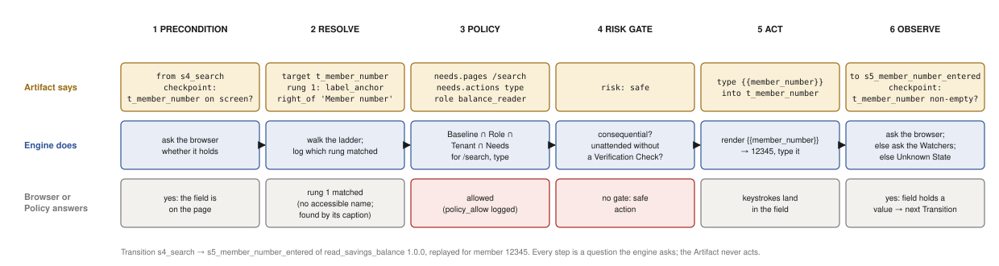
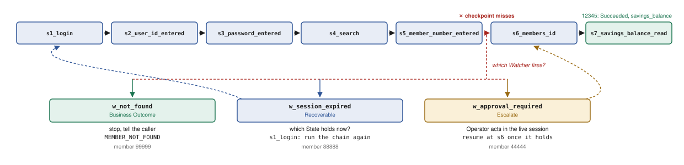
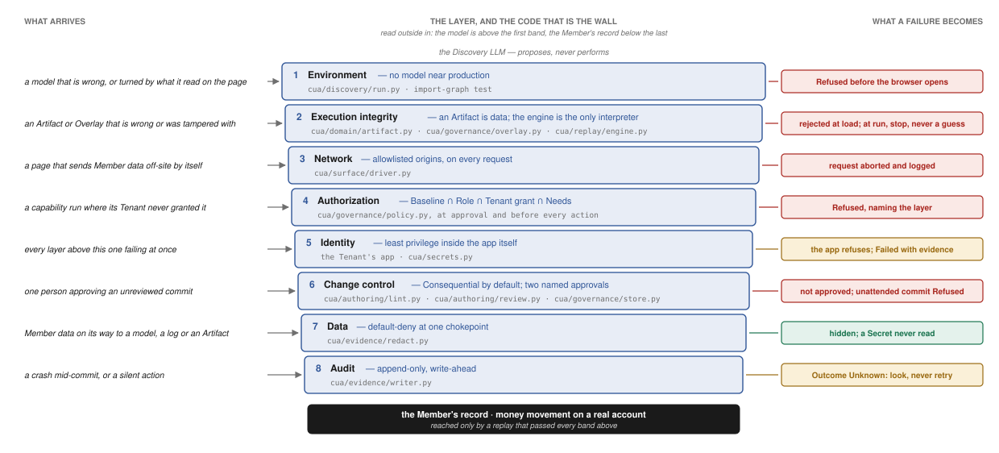

# REPORT

An LLM works out how a task is done in a legacy bank application **once**, against a
non-production copy. That run becomes a reviewable **Artifact**. From then on the **Replay
Engine** runs it with typed inputs and **no model in the decision loop**.

Vocabulary: [CONTEXT.md](./CONTEXT.md) · worked runs: [evidence/](./evidence/) · decisions:
[docs/adr](./docs/adr) · modules: [docs/modules.md](./docs/modules.md).

## 1. Architecture


**Figure 1.1 — One capability's path.** *A Reviewer states a goal and confirms the
Contract the LLM proposes. The Discovery Run drives a non-production app once, one
policy-checked action per turn. The Recorder turns the trace into a draft; the Reviewer
decides which clicks are safe and which screens are Watchers; the Verify Replay runs that
candidate with no model on a member discovery never saw, and only a pass enters the store.
In production a Calling Agent invokes the capability by name with typed inputs, the engine
replays it with Policy checked before every action, and returns one Run Result. When it
cannot safely continue it hands the live session to an Operator and resumes on a
re-checked Checkpoint.*

## 2. Artifact schema


**Figure 2.1 — The core of an Artifact is a state machine, adapted from the PreAct paper
from Li et al.<sup>[1]</sup>.** *A box is a State, the amber box under it is the
Checkpoint that must hold on the live screen before the engine believes it is there, and
an arrow is a Transition holding one Action. Read the top row left to right, then the
bottom row right to left. The engine executes this graph directly. Drawn from
[read_savings_balance.1.0.0.yaml](./artifacts/read_savings_balance.1.0.0.yaml), listed in
full as Figure S1 of [REPORT_SUPPLEMENT.md](./REPORT_SUPPLEMENT.md).*

```jsonc
{
  "capability": {"id", "version", "vendor_app", "role",
                 "status": "draft|approved", "approvals": []},

  "contract": {                         // all a Calling Agent depends on
    "inputs":   {"<name>": {"type", "pattern?", "sensitive", "required"}},
    "outputs":  {"<name>": {"type", "sensitive"}},     // what Succeeded returns
    "outcomes": [{"code", "meaning", "resolver": "member|institution_staff|nobody",  // business outcomes
                  "caller_hint", "retry_same_inputs": "never", "data"}]},

  "needs": {"pages": [], "actions": [], "secrets": []},   // the access this flow needs, derived from discovery, checked against Policy

  "states":      [{"id", "checkpoint": <predicate>, "terminal?": "succeeded"}],   // a state between actions, checked against its checkpoint (what the screen must show)
  "transitions": [{"from_state", "to_state",                                     // one action, from one state to the next
                   "action": {"type": "click|type|select|read", "target",
                              "value?|value_ref?|into?"},
                   "risk": "safe|consequential",
                   "verify_effect?": {"goto", "predicate": <predicate>},
                   "timeout_ms?"}],

  "targets":  {"<name>": {"frame?", "rungs": [<role_name | label_anchor | picture>]}},   // where an action lands: the control, found by a ladder
  "watchers": [{"id", "trigger": <predicate>, "provenance",                      // this flow's own triggers, mostly business outcomes;
                                                                                   // app-level ones (session expiry, notices, errors) come from the App Profile
                "condition": "business_outcome|recoverable|escalate|hard_failure",
                "outcome?|recovery?|budget?|resume_at?|operator_instruction?"}],

  "provenance": {"discovered_by", "contract_by", "example_values"}
}

<predicate> ::= element_present | text_present | field_value | url_matches | all | any
```

**Figure 2.2 — The schema every Artifact conforms to, adapted from the PreAct paper from
Li et al.<sup>[1]</sup>.** *Four blocks are additions the bank setting forces. The
contract is all a Calling Agent depends on: typed inputs validated before a browser opens,
outputs that a Succeeded result carries, and business outcomes, the legitimate non-happy
answers such as MEMBER_NOT_FOUND, each with who can resolve it. Needs is the access the
flow was seen to use during discovery, and Policy must grant every item or the run is
Refused. Targets are ladders, so a control is found by its accessible name, then by the
caption beside it, then by a picture, and replay records which rung matched. Watchers are
the flow's own triggers, while app-wide ones such as session expiry arrive from the App
Profile at load time. The last line is the grammar for every predicate in the file: the
only four questions the engine can ask a screen, or a combination of them, and never free
text. Models in [`cua/domain/artifact.py`](./cua/domain/artifact.py); an unknown key or
action type is rejected by parsing.*

## 3. Determinism & error handling



**Figure 3.1 — One Transition, walked through the engine.** *What makes replay
deterministic: every Transition of every Artifact asks the same six questions in the same
order, and none of the answers is a model's choice. The Artifact only supplies data (top
lane); the engine asks (middle); the browser or the Policy answers (bottom). Policy is
asked before acting, the Checkpoint after, so a click never lands on an unexpected screen
and a missed keystroke is caught at once. Shown for one real step of Figure 2.1, replayed
for member 12345. Engine: [`cua/replay/engine.py`](./cua/replay/engine.py).*

| Example on screen | Condition | Who acts | Reaction | Run Result if unresolved |
|---|---|---|---|---|
| Input fails its Contract type/pattern/enum | — (caught before the run) | nobody needed | never started | **Refused** |
| "No records found" | Business Outcome | nobody — it is the answer | stop | **Business Outcome** `MEMBER_NOT_FOUND` (resolver: Member) |
| "You are not authorized to view this member" | Business Outcome | institution staff, later | stop | **Business Outcome** `NOT_AUTHORIZED` (resolver: institution staff) |
| "Amount exceeds available balance", "maximum accounts reached" | Business Outcome | the Member, by supplying different input | stop | **Business Outcome** `VALIDATION_REJECTED` or a specific code |
| "System notice" interstitial | Recoverable | system | dismiss, re-check, continue | — (invisible when it works) |
| Slow or blank page, transient error | Recoverable | system | wait, retry, bounded, Safe Actions only | **Failed** when the budget runs out |
| Session expired, login page returns | Recoverable | system | sign in again with the Service Account, re-observe, continue | **Failed** when the budget runs out |
| A screen only a person's own credential clears (supervisor ID and PIN) | Escalate | Operator, live | pause, hand over the session, resume on the Checkpoint | **Aborted**, **Failed** on timeout — or **Outcome Unknown** if a Consequential Action was already in flight |
| "Application error" / stack trace | Hard Failure | nobody | stop with evidence | **Failed** |
| A screen matching neither Checkpoint nor Watcher | Unknown State | Operator if Attended; Reviewer later | never guess through | **Failed** (Unattended) |
| Frozen screen after a Consequential Action | Unknown State | system first (Verification Check), else Operator | look, never click again | **Outcome Unknown** |
| System died mid-Consequential Action | — | a person, afterwards | write-ahead log detects it on restart | **Outcome Unknown** |

**Figure 3.2 — Every surprise becomes one of four Conditions, and the test is who can
act.** *The system alone within a budget, a person during the run, or nobody in time. The
table is the one in [CONTEXT.md](./CONTEXT.md); budgets are in
[docs/error-taxonomy.md](./docs/error-taxonomy.md).*

| Level | Lives in | Watcher | Condition (see Figure 3.2) | Learnt how |
|---|---|---|---|---|
| **App-wide** | App Profile ([`config/profiles/demo-core-servicing.yaml`](./config/profiles/demo-core-servicing.yaml)), shared by every capability on the app | `w_session_expired` | Recoverable | added by a Reviewer after watching a run recover when an Operator pressed Resume without typing |
| | | `w_system_notice` | Recoverable | discovery clicked "OK" on the notice; the Reviewer made that click a Watcher, not a step |
| | | `w_approval_required` | Escalate | added by a Reviewer: only a supervisor's own credential clears it |
| **Capability-specific** | the Artifact itself, alongside the Contract's Outcome Codes | `w_not_found` | Business Outcome `MEMBER_NOT_FOUND` | a second Discovery Run on member 99999 ended `report_outcome`; provenance `disc_0a3f513c` |
| | | `w_not_authorized` | Business Outcome `NOT_AUTHORIZED` | added by a Reviewer by hand; provenance `reviewer:nasi` |

**Figure 3.3 — Watchers live at two levels, and each records where it came from.** *How a
Condition is handled is Figure 3.2; this is where the Watcher that names it lives. The
Capability Store merges the App Profile's Watchers into the Artifact at load time, so
app-wide knowledge is learnt once and reaches every capability; where both declare the
same id, the Artifact's wins. A capability-specific Watcher that names an Outcome Code
must have that code in the Contract, and every declared code must have a Watcher that can
produce it: the lint refuses either alone. An unknown condition, such as
`MAX_ACCOUNTS_REACHED` for member 33333, is an Unknown State until a Reviewer turns the
evidence into a new Watcher, which is a new Artifact version.*

- **One Run Result**: Succeeded, Business Outcome, Failed, Aborted, Refused (nothing
  touched), or Outcome Unknown: a commit happened and could not be confirmed, so do not
  retry, a person must look.
- **Every commit carries a Verification Check.** When the screen after a consequential click
  does not resolve, the engine looks for the effect instead of clicking again. Member 33333
  hits a held-out condition, `MAX_ACCOUNTS_REACHED`, and the check confirms the commit did
  not take effect. Adding that Watcher and code is a new version: the learning loop.
- **The hole I know about.** The check runs only on the unrecognized route, so a Recoverable
  firing *after* a commit would rewind and commit again. Not reachable in this app; fix is
  item 0 of §7.



**Figure 3.4 — The same Checkpoint miss, answered three ways.** *The chain of Figure 2.1
under four replays: the chain is read from the artifact, each branch from the Watcher that
fired. Member 12345 never leaves the chain. The other three all miss the same Checkpoint,
and the Watcher that recognizes the screen decides what happens next: a Business Outcome
stops and tells the caller; a Recoverable asks which State holds now and runs the chain
again from there; an Escalate hands the live session to an Operator and resumes once the
Checkpoint holds. Each run in full, drawn from its trail: Figure S2 of
[REPORT_SUPPLEMENT.md](./REPORT_SUPPLEMENT.md).*

## 4. Heterogeneity & multi-tenant

**No clean DOM, and sometimes no DOM at all.** The brief's first worry. A Target is a
ladder: the control's accessible name, then the caption beside it plus layout, then a
picture. Each rung breaks for a different reason (the table in
[CONTEXT.md](./CONTEXT.md)), replay logs which one matched, and a Target stores a
relationship, never a measurement. The engine reaches the app through one `Surface` seam
of nine verbs, with Predicates evaluated above it, so a desktop or Citrix surface
implements nine methods and nothing else; the three rungs exist there too, in UI
Automation and AX, and the picture rung is the answer where there is no tree at all. The
picture matcher is a stub today (§7).


**Figure 4.1 — One turn three ways, adapted from the AgentRR paper from Feng et
al.<sup>[2]</sup>.** *The masked screenshot the model saw, the accessibility list it read,
and the recorded Target, for the unlabelled search icon: an `` in a `<button>` with
no alt, so it has no accessible name and a text-only agent cannot see it. It is found by
the caption beside it, and the ladder records that.*

**One artifact, many institutions.** Reuse is composition, not a recording per bank.

```
   App Profile     per vendor app     shared Watchers, Readable and Sensitive Regions
        +
   Artifact        recorded once      the flow; its own Watchers win on a clash
        +
   Tenant Overlay  per institution    how a control is FOUND: labels, anchors, relations
                                      never what the flow DOES: transitions, contract, needs
        =
   what replays at this Tenant
```

**Figure 4.2 — Three-level composition
([`cua/governance/overlay.py`](./cua/governance/overlay.py)).** *Demonstrated end to end:
the Artifact recorded at First Credit Union fails honestly at Lakeside Savings,
`unknown_state` at the first Checkpoint because the field is called "Find member by #",
and runs unchanged with a 20-line Overlay
([overlays/lakeside.yaml](./overlays/lakeside.yaml)). An Overlay that adds a transition,
changes the contract or widens needs is refused before a browser opens.*

**Knowing when a tenant has drifted.** Every run already logs which rung found each
Target, so the Fallback Match rate, how often a ladder got past its first rung, is a
per-tenant, per-version number that rises before anything breaks: a re-skinned app starts
matching by caption instead of name; renamed captions stop matching and fail at a
Checkpoint rather than clicking the wrong thing. Reading that signal across runs is
designed, not built (§7).

## 5. Escalation & handoff

```
  automation ──► awaiting_operator ──► operator_in_control ──► resuming ──► automation
       │                 │                     │                   │
       └─────────────────┴─────────────────────┴───────────────────┴──────► done
```

**Figure 5.1 — Control is a lease ([`cua/replay/handoff.py`](./cua/replay/handoff.py)).**
*One holder at a time, illegal moves raise, and `done` is reachable from any state. The
Operator gets the same browser the automation was using, mid-flow.*

- **Stuck is detected** by a Watcher whose Condition is `escalate`, an Unknown State in an
  attended run, or during discovery the model calling `ask_human`, and a stuck detector. An
  `Intervention` file carries the State, the reason, the live URL, a screenshot and the
  instruction a Reviewer wrote once on the Watcher.
- **Same browser, same page.** Handback is Resume or Abort in the console, or the engine
  noticing the blocking screen is gone. Resume never assumes they finished: it asks which
  Checkpoint holds, so a wandered-off Operator gets `resume_checkpoint_missed`. Two
  escalations per State. Recorded: who, what decision, whether they navigated; never what
  they typed.
- **The demo's escalation is the honest shape**: member 44444 needs a supervisor's own ID
  and PIN, held in no Role's secrets. The console is a mock Flask page; the lease, transfer,
  recording and auto-resume are real.

## 6. Safety

**What is protected, and from what.** The assets are a Member's record and the
irreversible actions an app can take on a real account: opening it, moving its money. The
threats, outside in: a model that is wrong or that page content has turned; a page that
sends data off-site by itself; an Artifact or Overlay that is wrong or was tampered with;
a capability run where its Tenant never granted it; one person committing alone; a crash
mid-commit. The rule of the design is that the dangerous action is *impossible*, not
disallowed: a model that ignores an instruction still hits a wall made of code,
configuration or the Tenant's own system, and each wall is built as if every wall above
it had already failed.



| # | Layer · principle | Counters | Enforced by, and when | Owned by | A failure becomes | Not built, or weak |
|---|---|---|---|---|---|---|
| 1 | **Environment** · no model near production (ADR 0003) | a wrong or injected model acting on real Members; anything leaving the institution in production | the Tenant Policy's `environment` tag, refused in [`cua/discovery/run.py`](./cua/discovery/run.py) before a browser opens; the import-graph test in [`tests/test_safety.py`](./tests/test_safety.py) proves replay imports no model SDK | the Tenant tags each instance; the provider's package layout | Refused, no browser opened | credential separation by phase is deployment design |
| 2 | **Execution integrity** · an Artifact is data and the engine its only interpreter (ADR 0001) | an Artifact or Overlay that is wrong or tampered with; drift guessed through; a retry that repeats a commit | closed vocabularies in [`cua/domain/artifact.py`](./cua/domain/artifact.py): four Actions, four Predicates, and the schema rejects any other; [`cua/governance/overlay.py`](./cua/governance/overlay.py) rejects an Overlay that touches behaviour or widens Needs; [`cua/replay/engine.py`](./cua/replay/engine.py) stops on an Unknown State, never retries a Business Outcome, and looks (Verification Check) before it clicks again | the provider; an Artifact changes only by a new reviewed version | rejected at load; at run, Failed or Outcome Unknown, never a guess | a Fallback Match is allowed and only logged; its rising rate is the drift signal, not a stop |
| 3 | **Network** · allowlisted origins, on every request | exfiltration the page starts itself: `/leaky` renders a 1×1 image with member data in its URL; a cookie crossing Tenants; downloads, popups, permission prompts | a route gate in [`cua/surface/driver.py`](./cua/surface/driver.py) on every request the browser makes, page-initiated included; downloads off, extra pages closed, permissions denied, dialogs dismissed, a fresh context per run; a test proves only the Surface module touches the browser | the Tenant declares its origins in the Allowlist; the provider's driver enforces | the request is aborted and logged; an undeclared origin is Refused before a browser opens | enforced in the browser; an egress allowlist at the container is design only |
| 4 | **Authorization** · Baseline ∩ Role ∩ Tenant grant ∩ Needs (ADR 0005) | a capability run where its Tenant never granted it; an Artifact using a page or action outside its Role; a read Role committing | [`cua/governance/policy.py`](./cua/governance/policy.py) over four files owned by four parties: at approval (Needs must fit the Role), before a browser opens, and before every action; each layer may narrow, none may widen | Baseline: the provider · Role: a Reviewer, before discovery · grant: the Tenant · Needs: what the Discovery Run did | Refused, naming the layer that refused: a guarantee of no side effects | the route keyword deny-list is a weak second net |
| 5 | **Identity** · least privilege inside the app itself | every layer above failing at once | the Tenant's app, signed into as the Role's Service Account, resolved at the keystroke by [`cua/secrets.py`](./cua/secrets.py): `balance_reader` signs in as `svc_read`, which has no sub-account form | the Tenant, which issues the account | the app refuses; the run Fails with evidence | — |
| 6 | **Change control** · Consequential by default; two named approvals; separation of duties (ADR 0002) | an unreviewed or unverifiable commit; one person approving their own work; a Reviewer reaching a live session | [`cua/authoring/lint.py`](./cua/authoring/lint.py) and [`review.py`](./cua/authoring/review.py): every click arrives Consequential and only a Reviewer may mark it Safe; a discovery literal or an unfilled placeholder fails the lint; two approvals for an Artifact that commits; a Verify Replay on inputs discovery never saw; a Verification Check per Consequential Action before unattended use; the engine refuses any Artifact not marked approved, and the Capability Store never lets a re-review displace an approved version | the Reviewer approves and never sees a live session; the Operator alone touches one; the Recorder decides nothing | not approved; an unattended commit without a Verification Check is Refused | no identity system behind Reviewer and Operator names |
| 7 | **Data** · default-deny at one chokepoint (Figure 6.2) | Member data reaching a model, a log, a screenshot or an Artifact; a Secret reaching anything | [`cua/evidence/redact.py`](./cua/evidence/redact.py) on the way to a model and on the way to evidence; Secrets by name, substituted at the keystroke; evidence records identifiers we generated, never page text; outputs to the caller in full, masked in the record | the Reviewer declares Readable and Sensitive Regions in the App Profile, per app, not per capability | hidden; a canary value never appears in evidence (test) | pixels: a control is never painted |
| 8 | **Audit** · append-only, write-ahead | a silent action; a crash mid-commit passing as a mere failure; unexplained drift | [`cua/evidence/writer.py`](./cua/evidence/writer.py): one writer, a line flushed before every action, every policy decision and every matched rung recorded; on restart an in-flight commit closes as Outcome Unknown | the provider writes; the Operator reads during a run, the Reviewer after | Outcome Unknown: a person looks, nobody retries | a hash chain for tamper evidence is design only |

**Figure 6.1 — Defence in depth: eight layers, each a wall of code, configuration or
someone else's system, none an instruction to the model.** *Read outside in, from the
model to the Member's record. Each row names the threat the layer exists for, who owns
it, when it is enforced and what a failure there becomes: a refusal, a stop or an Outcome
Unknown, never a fallback to judgement. Each layer is built as if every layer above it
had already failed. The first is what makes the rest affordable: nothing production is
ever in front of a model. The last column is what is not built, stated so a reader does
not have to find out.*

```
          A VALUE ON SCREEN
                │
       ┌────────▼─────────┐
       │ is it a password?│──yes──► (protected)      never read at all
       └────────┬─────────┘
                │ no
       ┌────────▼──────────────────┐
       │ is its Target declared a  │──no──► (hidden)  ← names, birthdays, and every
       │ Readable Region?          │                    field nobody has reviewed yet
       └────────┬──────────────────┘
                │ yes
       ┌────────▼─────────┐
       │ pattern net      │  SSN · card · email · phone · date · currency
       └────────┬─────────┘
                ▼
            recorded                and in the screenshot: undeclared value cells,
                                    Sensitive Regions and text patterns painted black
```

**Figure 6.2 — Layer 7, redaction: structural, origin, pattern, pixels.** *A name is just
words and a birthday is just digits, so no pattern can find them; the origin layer hides a
value unless its Target is a declared Readable Region, which is what makes an unreviewed
screen safe by default. The pattern net then catches what does come through. Pixels are
the weaker channel: undeclared value cells and declared Sensitive Regions are painted
black at capture, but a control is never painted, or the model could not click it.*

**What a model sees, and when.** In discovery, against non-production only, every
observation passes Figure 6.2 twice: the text channel (a password is never read; every
other value is hidden unless its caption is a Readable Region; the survivors pass the
pattern net) and the screenshot (undeclared value cells, Sensitive Regions and declared
text patterns painted black, then cropped and downscaled). Measured on a real run, the
model saw the member's name and join date as `(hidden)` and the balance as `$*,***.**`,
and still reached the goal, because it needs the label to know which cell to read, not the
value. In production there is no model: replay reads the balance with a `read` action and
returns it to the caller in full, and a screenshot is taken only on failure or escalation,
through the same chokepoint. In this repository every run, including the production-side
replays in [evidence/](./evidence/), is against the fake bank with synthetic members; no
real institution data exists anywhere in it.

**Limits, plainly** ([docs/security-model.md](./docs/security-model.md)): the last
column of Figure 6.1 is the residual risk register. Three points deserve a sentence.
Pixels are the weaker channel, since a control is never painted. Prompt injection is
mitigated by the model only proposing while code performs, not solved: a convincing
injection can still waste a discovery run, never a production one. NER is not in the data
path because 90–95% recall is a disclosure rate, not a gate.

## 7. Cuts

**Cut deliberately**: the operator console is a mock over the run directory; no catalog API
beyond `--list`; one vendor app and one surface, so §4 is an argument; **no LLM fallback on
replay**, by design; the picture rung is a stub; no drift dashboard or identity system;
versioning is one-deep, so re-approving replaces the live capability, and the Store's
"highest version" is a string sort.

**Not done**: only one model ran discovery (`DISCOVERY_MODEL`, default `claude-opus-5`),
so no model was compared against another; the model's success rate was not tracked, so
there is no count of how often a Discovery Run reaches an Artifact that passes the Verify
Replay; and the Discovery Run loop in [`cua/discovery/run.py`](./cua/discovery/run.py) is
not tested, live or stubbed, so the tests cover the request it receives and the import
graph around it, not the loop itself.

**Next, in order**: (0) ask the Verification Check *before* a commit and skip it when the
effect is already there, so a rewind can never open a second account; (1) `NO_SAVINGS_ACCOUNT`
as an Outcome Code with its Watcher; (2) the drift alarm, reading evidence across runs;
(3) replay N times and report flakiness ([docs/evaluation.md](./docs/evaluation.md)); (4) a
second `Surface`, so the seam is proven.

## References

1. Bojie Li et al. *PreAct: Computer-Using Agents that Get Faster on Repeated Tasks.*
   Pine AI, 2026. [arXiv:2606.17929](https://arxiv.org/abs/2606.17929).
2. Feng et al. *Get Experience from Practice: LLM Agents with Record & Replay (AgentRR).*
   IPADS, Shanghai Jiao Tong University, 2025.
   [arXiv:2505.17716](https://arxiv.org/abs/2505.17716).
