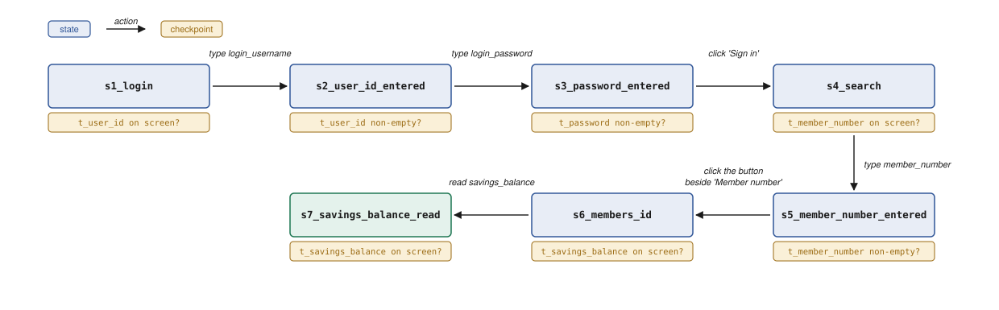

# REPORT

## 1. Architecture


**Figure 1.1 — One capability's path.**

**The shape is record-and-replay**, after PreAct from Li et al.<sup>[1]</sup> and
AgentRR from Feng et al.<sup>[2]</sup>: the LLM discovers and the engine replays. Two
gates stand between the two. The **Review Gate**, which the brief asks for, asks a human
to confirm each click as Safe or Consequential/risky (risky by default) and to add the
error handling the capability needs; the **Verify Replay**, adapted from
PreAct<sup>[1]</sup>, is a second gate, at the cost of one more run per approval.

**The choices the brief leaves open.** (1) **Python**, with Playwright and a Flask
stand-in app. (2) **One synchronous process**: a replay is a function call that returns
a Run Result. (3) **Playwright, for the accessibility tree**: controls are found by role,
name and geometry, not markup, at the cost of a browser-only seam (§4). (4) **Claude, one
tool call per turn** from eight predefined tools, given the live controls, masked text
and a redacted screenshot; the model proposes, code acts. (5) **A local legacy-style bank
app with no clean DOM**, where the member number selects the runtime condition, so every
error class in §3 is reproducible.

## 2. Artifact schema



**Figure 2.1 — The core of an Artifact is a state machine, adapted from PreAct<sup>[1]</sup>.**
*A box is a State, the amber box under it the Checkpoint that must hold on the live
screen, an arrow a Transition holding one Action.*

```jsonc
{
  "capability":  {"id", "version", "vendor_app", "role", "status": "draft|approved", "approvals": []},
  "contract":    {"inputs", "outputs", "outcomes": [{"code", "meaning", "resolver", "caller_hint"}]},   // all a Calling Agent depends on
  "needs":       {"pages": [], "actions": [], "secrets": []},   // derived from discovery, checked against Policy
  "states":      [{"id", "checkpoint": <predicate>, "terminal?"}],   // what the screen must show
  "transitions": [{"from_state", "to_state", "risk": "safe|consequential", "timeout_ms?", "verify_effect?",
                   "action": {"type": "click|type|select|read", "target", "value?|value_ref?"}}],   // one action, one state to the next
  "targets":     {"<name>": {"frame?", "rungs": [<role_name | label_anchor | picture>]}},   // where an action lands, found by a ladder
  "watchers":    [{"id", "trigger": <predicate>, "condition": "business_outcome|recoverable|escalate|hard_failure",
                   "outcome?|recovery?|resume_at?|operator_instruction?"}],   // app-level ones come from the App Profile
  "provenance":  {"discovered_by", "contract_by", "example_values"}
}
<predicate> ::= element_present | text_present | field_value | url_matches | all | any
```

## 3. Determinism & error handling

**How replay runs.** The Replay Engine takes the Artifact as its guidance and Python
plus Playwright as its hands and feet. It walks the transition list in a loop, and for
each transition asks the live page narrow questions, in order: (1) am I in the right
place? the from-state's Checkpoint; (2) where do I act? the Target's ladder; (3) may I,
and is it risky? the Policy check, then the risk gate, where a Consequential/risky click
waits for an Operator; (4) act: "click", "type", "select" or "read"; (5) did I arrive?
the to-state's Checkpoint. If a Checkpoint does not pass, the engine goes down the
Watcher list and the first match decides: recover and continue, return a business
outcome, hand to a human, or stop. No match is an Unknown State: verify the effect if
the action was a commit, hand over if a person is present, otherwise quit with a
screenshot. Waiting is never a sleep: a Checkpoint is polled until it holds or the
transition's `timeout_ms` runs out, and every retry has a budget. A Run Result is one of
six statuses, Succeeded with outputs, Business Outcome, Failed, Refused, Aborted or
Outcome Unknown, and a Failed one carries the step, the Checkpoint expected, what was
observed and an evidence id.

**Error handling.** There are two kinds of error. An **app-level** error is well known
and pre-established, such as a timeout, a session expiry or a system notice; it is
recorded in the App Profile by an engineer stress-testing the app ahead of time. A
**capability-level** error is derived from runs: an engineer builds the edge cases for
that capability and uses the LLM to derive what each one looks like and what to do
about it. Both kinds become Watchers on one list, a Watcher being what a screen means
(its trigger) and what to do about it (its Condition and reaction), and at the Review
Gate the Reviewer chooses which to add (every Condition, its reaction and Run Result:
supplement Figures S4 and S5).

## 4. Heterogeneity & multi-tenant

**The seam.** The Replay Engine never touches a browser. It speaks to one Protocol,
`ActingSurface`, of a dozen methods: resolve a Target, click, type, select, read,
screenshot, current URL. Playwright implements it today; a desktop accessibility API or
OCR over a screenshot would implement the same dozen, and the Artifact would not change,
because a Target is not a selector. It is a role and a name, or a named caption and a
relation, "right of", scored over bounding boxes, which every surface has. Two parts of
the schema are web-shaped and would need a desktop reading: `url_matches` and `frame`.

**Layout drift.** A Target, where an action takes place, is found by a ladder of rungs, tried in order: (1) **name**,
the accessibility tree's role and name, "button Search"; (2) **position relative to a
known object**, "the textbox right of 'Member number'", scored over bounding boxes; (3)
**picture**, a template match on a crop, in the schema and not implemented. Every
transition records which rung found its Target, so a rising fallback rate for one tenant
or vendor version is the drift signal. A shift that leaves the same rung matching, a box
nudged right but still right of "Member number", escapes it, and is harmless.

**Multi-tenant handling.** One approved Artifact per vendor product; a Tenant Overlay per
institution patches Targets only: origin, labels, where a control sits, so when a name
changes between institutions the Overlay says: in institution A, look for "Find member
by #" instead of "Member number". An Overlay that touches transitions, contract or needs
is refused, so a cosmetic file cannot alter a reviewed flow.

## 5. Escalation & handoff

**What "stuck" means.** Every stop starts the same way: a Checkpoint does not match the
live screen within the transition's `timeout_ms` (6 s by default). Two cases: (1)
**intentional error handling**: the screen matches a Watcher, and its Condition decides.
A business outcome, a recoverable and a hard failure are all handled or ended without a
person; only a Watcher whose Condition is `escalate`, a known screen that only a person
can clear, counts as stuck; (2) **surprise**: the screen matches no Watcher, an Unknown
State. Always stuck. Both hand over the live session only when an Operator is present:
the run waits `--wait` seconds (240 by default) for a Resume or Abort, then fails on
timeout, and no State may escalate more than twice. Unattended, the run fails as
`escalation_required` or `unknown_state`.

**Handoff.** The run pauses, writes an intervention request (capability, State, reason,
live URL, screenshot, the Reviewer's instruction) and gives the lease to the Operator,
who works in the same browser window, on the same page. Control comes back on Resume,
on Abort, or when the blocking screen is gone; Resume re-checks which Checkpoint holds
and continues from there. Recorded: who acted, the decision, and whether the URL changed.

## 6. Safety

**What the LLM can access during discovery.** (1) **Synthetic data only**: a separate
server with no real data, so the outermost layer is the environment. (2) **The
Baseline**, owned by the agent vendor: the four action types the engine implements, the
denied route keywords, and the hard rules, the floor no Tenant can lower. (3) **The
Tenant Policy**, owned by the institution: which origins exist, which Roles it grants
and on which Service Account, and any narrowing of the Role's pages. (4) **RBAC**: a
least-privilege Role was chosen when the Contract was proposed, which limits what the
agent can access, whatever the goal says. Under all four, the browser itself aborts any
request to an origin the Tenant Policy does not declare, so a page the model was never
shown cannot be fetched either.

**What the LLM can see.** Every observation passes through redaction before it reaches
the model, as text and again as pixels: (1) **a secret is never read at all**: a password
field's contents are never read, and other secrets are declared by name in the Role and
referenced by name in the Artifact, so the value is substituted at the keystroke and never
enters the observation, the trail or the file; (2) **a value is hidden unless its region
is declared readable** in the App Profile, and every other value is `(hidden)`; (3) **a
pattern net** catches what comes through: SSN, card, email, phone, date, currency; (4)
**the screenshot is redacted too**: undeclared value cells, Sensitive Regions and declared
text patterns are painted black at capture.

**At replay there is no LLM**, so the gate is on the Artifact instead. Its Needs
are checked against Policy before a browser opens and again before every action. Every click was unsafe until the Reviewer declared
it Safe, and a Consequential/risky one never runs without an Operator present. The
engine implements only "click", "type", "select" and "read", and the Baseline
([config/baseline.yaml](./config/baseline.yaml)) names what was refused:
download, upload, script execution, new tabs, and any route whose path includes a denied
keyword such as `delete`, `admin`, `wire` or `transfer`.

**Limits.** Screenshot redaction still needs work: buttons and fields are never blacked
out, because the model has to see what it clicks, so a value shown inside a control can
still reach it. And prompt injection is contained, not solved: text on a page can try to
instruct the model, but the model can only propose and code checks every action, so the
worst case is a wasted discovery run, never a production one.

## 7. Cuts
(1) **Money movement.** Any route naming money movement, `wire`, `transfer` or `payment`
among the Baseline's denied keywords, is refused; the `funds_mover` Role is kept only as the shape of that future feature. (2)
**Automatic error handling from production.** A production error does not route itself
back to the non-production LLM to record its own handling, as PreAct<sup>[1]</sup>
suggests; Watchers are derived at discovery and tested by an engineer instead. (3)
**Model comparison and optimisation.** Only one model ran discovery
(`DISCOVERY_MODEL`, default `claude-opus-5`); no success rate was tracked.

**Next, in order.** (1) **Production errors route back automatically** to the
non-production LLM agent, which records the handling as a proposed Watcher for a Reviewer
to approve; (2) **a money-handling protocol**: the `funds_mover` Role, a Verification
Check asked *before* every commit so a rewind can never pay twice, and a caller-supplied
idempotency key.

## References

1. Li et al. *PreAct: Computer-Using Agents that Get Faster on Repeated Tasks.* 2026. [arXiv:2606.17929](https://arxiv.org/abs/2606.17929).
2. Feng et al. *Get Experience from Practice: LLM Agents with Record & Replay.* 2025. [arXiv:2505.17716](https://arxiv.org/abs/2505.17716).
