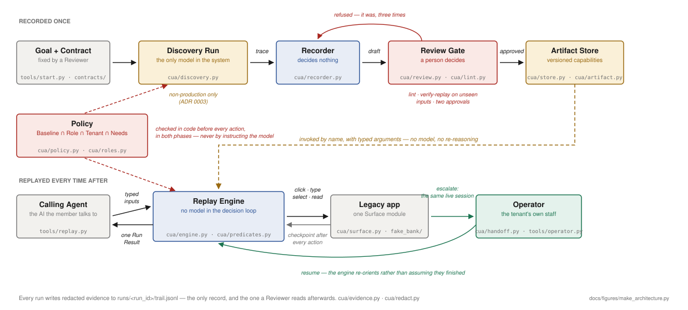
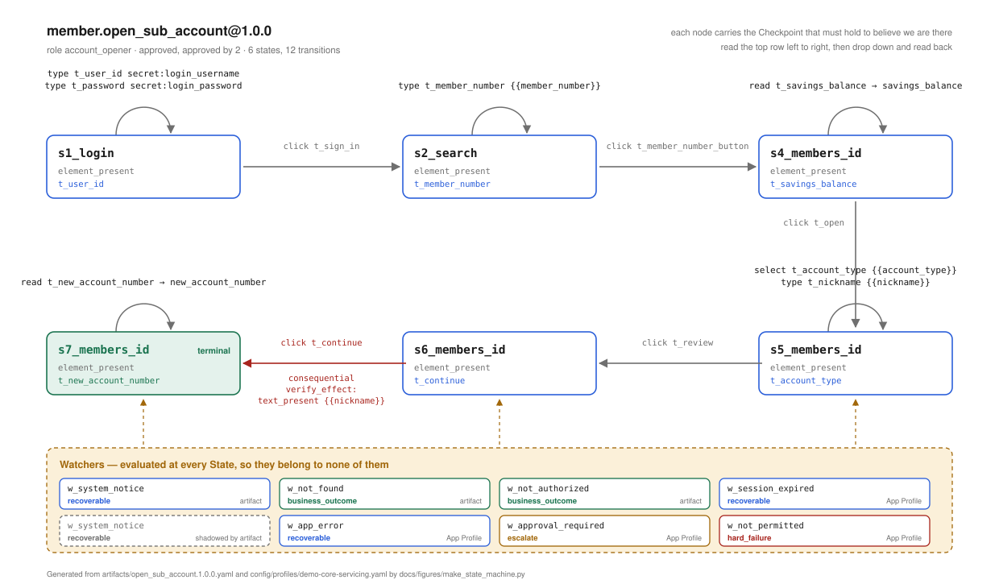
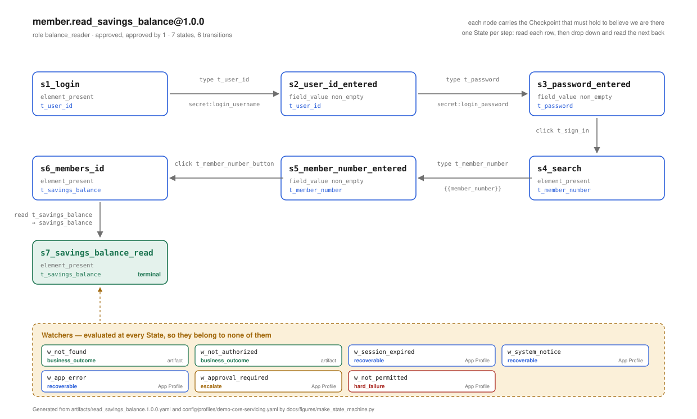
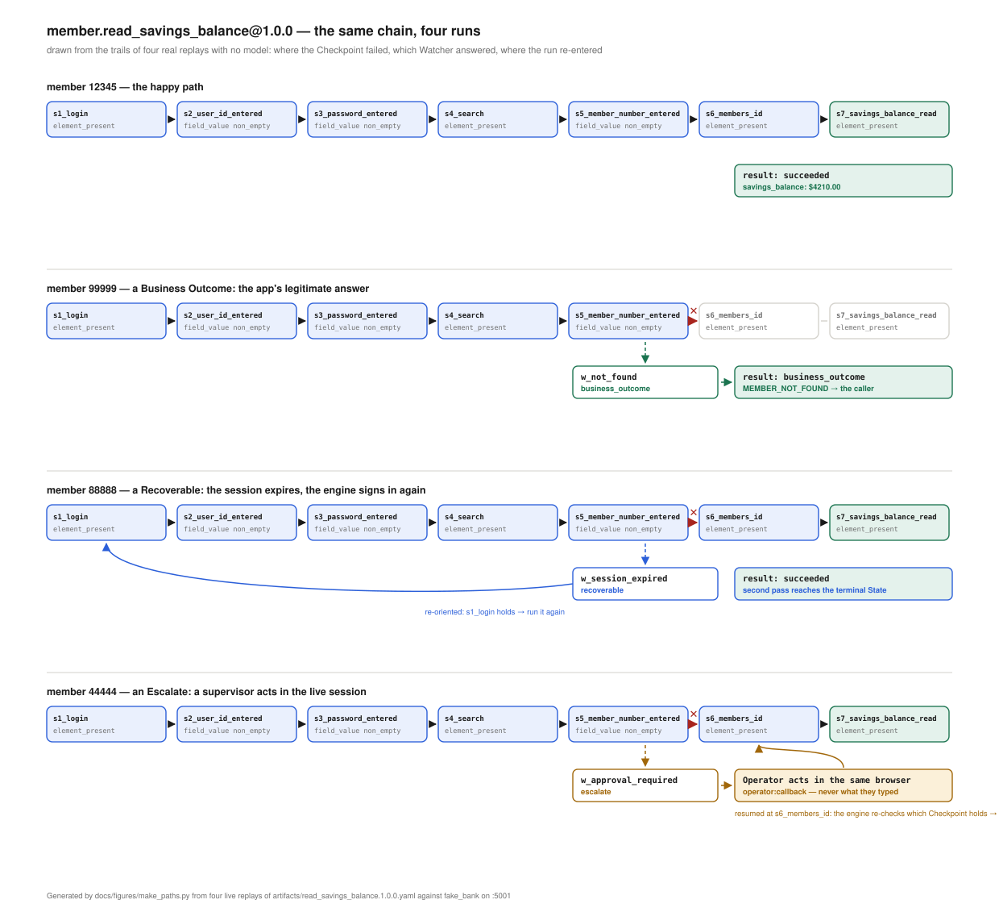

# REPORT

An LLM discovers how a task is done in a legacy bank application **once**, against a
non-production copy. That run is compiled into a reviewable **Artifact**. Thereafter the
**Replay Engine** executes it with given inputs and **no model in the decision loop** — the
only way a capability runs in production.

Worked runs, with the trail for each: **[evidence/](./evidence/)**.
Vocabulary: [CONTEXT.md](./CONTEXT.md) · decisions: [docs/adr](./docs/adr) · detail:
[error-taxonomy](./docs/error-taxonomy.md), [security-model](./docs/security-model.md),
[targeting](./docs/targeting.md), [evaluation](./docs/evaluation.md).

## 1. Architecture



A goal enters on the left and is compiled into a capability **once**; every later
invocation is served from the store with no model in it. Red is a gate that can refuse,
green is a person, and the dashed amber arrow is the only path from the recorded phase into
the production one. Regenerate with `python docs/figures/make_architecture.py`.

**The Artifact is data interpreted by one engine, not generated code** (ADR 0001). The engine
holds every function — four actions, four predicates, three ways to find a control, the
policy check, risk gate, retry budgets, redaction — and an Artifact can only *name* things
from those vocabularies. So none can bypass a guarantee, and a reviewer reads a flow rather
than audits a program. The cost: a flow needing something the vocabulary cannot express takes
an engine change and a review, not a clever recording. That is the right side to be wrong on
for software that clicks "Continue" on an account opening.

**One module touches the browser, one touches a model.** [`cua/surface.py`](./cua/surface.py) is the only file
importing Playwright; `anthropic` appears only in [`cua/discovery.py`](./cua/discovery.py),
and a transitive import-graph test asserts `discovery` is unreachable from `engine`
([`tests/test_safety.py`](./tests/test_safety.py)). "No LLM in replay" is a
property of the code, not a sentence in a README. Surface is also the seam for other
surfaces (§4).

**Where the goal enters.** A goal is stated once, by a Reviewer, at discovery —
`tools.start` asks "What do you want to do today?", the model proposes a Contract and the
narrowest Role, the Reviewer confirms, and the confirmed request is a file in
[`contracts/`](./contracts/) that `tools.discover` runs. The same session reviews the
draft Artifact the moment the run reaches its goal — which clicks are safe, how each
declared outcome is recognised on screen (borrowing watchers from approved capabilities on
the same app), who approves — writes the answers to `artifacts/<name>.decisions.yaml`,
and approves only after lint and a model-free verify-replay on unseen inputs; production callers never state
goals — they invoke an approved capability by name with typed inputs. The goal is free
text and the model reads it every turn, but it is only one of three parts of a Discovery
Request: the **Role** bounds what the goal may touch (pages, actions, whether it may commit),
so "wire $5,000" under `balance_reader` is `policy_deny` at every step the model proposes
toward it and `give_up` after three;
and **the Contract is fixed before discovery.** Inferring a capability's signature from
whatever one run happened to do makes the transcript the source of truth. The LLM proposes a
Contract from the goal, a Reviewer confirms it, discovery has to satisfy it.

Single process, files for state — no queue or service split, which the brief does not reward.
Python, Playwright, Pydantic, YAML, Flask, Claude. `fake_bank/` is hostile on purpose:
server-rendered nested tables, no ids or test ids, session-scoped control names, an
unlabelled icon button, duplicate "Open" text, balances in an iframe.

**Every module, in the order the data flows through it — with what goes in and what comes
out.** `cua/` is the system; `tools/` are entry points that only wire it together;
`fake_bank/` is the target. Nothing in `cua/` imports from `tools/`. Examples are the demo's
real values.

| Module | In → Out (example) | Does |
|---|---|---|
| **discovery** — once per capability, model in the loop | | |
| `cua/discovery.py` | `propose_contract("read a member's savings balance")` → `{role: balance_reader, contract: {inputs: {member_number…}, outputs: {savings_balance: money}, outcomes: […]}}` ; `discover(DiscoveryRequest(goal, contract, role, origin))` → `DiscoveryResult(ending=goal_reached, outputs={savings_balance: "$4210.00"}, draft=runs/disc_x/draft.yaml)` + `trail.jsonl` | the only module that touches a model: proposes a Contract + Role from a goal; runs observe → decide → act, one policy-checked action per turn |
| `cua/recorder.py` | `actions.json` (13 recorded actions: url, action, target ladder, value) + contract + example values → draft dict: 14 states, 13 transitions, `{{member_number}}` where `54321` was typed; plus suggestions (`"action 6 clicks 'OK' on /members, a page visited once…"`) | turns a run into a draft Artifact — one State + one Checkpoint per step; decides nothing |
| `cua/review.py` | `apply_decisions(draft, decisions.yaml)` → candidate (4 clicks now safe, `t_ok` → `w_system_notice`, 2 watchers added, `VALIDATION_REJECTED` dropped) ; `approve(candidate, verify)` → `(Artifact status=approved, [])` or `(None, ["[consequential_without_verification] …"])` | applies a Reviewer's decisions mechanically; approves only if lint passes and a model-free verify-replay succeeds |
| `cua/lint.py` | `lint(artifact)` → `[Issue(code="unreachable_outcome", where="contract", detail="'NO_SAVINGS_ACCOUNT' is declared but no watcher can produce it")]` or `[]` | what a well-formed Artifact must also satisfy before it can be trusted |
| **the artifact** | | |
| `cua/artifact.py` | `Artifact.model_validate(yaml)` → typed `Artifact`, or `ValidationError: transitions.3.action.type … 'hover' is not one of click/type/select/read` | the schema — a closed vocabulary; an unknown key or action is rejected |
| `cua/store.py` | `load_capability("member.open_sub_account")` → the `1.0.0` approved Artifact with its App Profile merged (7 watchers); `artifacts()` → every file on disk, for `--list` | which Artifact is live: the highest approved version of a capability id |
| `cua/profile.py` · `cua/overlay.py` | `load_profile("demo-core-servicing")` → shared watchers (`w_session_expired`…), readable/sensitive regions ; `apply_overlay(artifact, overlays/lakeside.yaml)` → same flow, `t_member_field` now found by caption "Find member by #"; an overlay adding a transition → refused | per-app knowledge shared by every capability; per-tenant appearance, never behaviour |
| **production** — every invocation, no model | | |
| `cua/policy.py` · `cua/roles.py` | `policy_for(artifact, "bank_b").refuse_reason(artifact)` → `"tenant 'bank_b' does not grant role 'account_opener'"` ; for `bank_a` → `None` ; `allows_page("/admin")` → `False` | permissions as an intersection: Baseline ∩ Role ∩ Tenant grant ∩ Needs; refused before the browser opens |
| `cua/engine.py` | `replay(artifact, {member_number: "12345", …}, RunContext(origin))` → `RunResult(status=succeeded, outputs={savings_balance: "$4210.00", new_account_number: "SA-2001"})` ; member `99999` → `RunResult(status=business_outcome, outcome={code: MEMBER_NOT_FOUND, resolver: member, retry_same_inputs: never})` ; `33333` → `RunResult(status=failed, reason=unknown_state, step=s13_members_id, verified_effect=False)` | the Replay Engine: checkpoint → resolve → policy → act → checkpoint; Watchers on a miss; recovery budgets; escalation; the Verification Check |
| `cua/predicates.py` | `holds({type: field_value, target: t_member_number, non_empty: true})` → `True`/`False` ; `holds({type: text_present, value: "No records found"}, timeout_ms=0)` → `True` on the not-found screen | evaluates the four predicates against a Surface, placeholders rendered from the run's inputs |
| `cua/surface.py` | `resolve(t_member_number_button)` → `Resolved(locator, matched_by="label_anchor", rung_index=0)` or `None` ; `controls()` → `[{index: 2, role: "textbox", name: "", anchor: "User ID", is_password: False, frame_url: …}, …]` ; `text()` → all visible text, frames included | the only module that touches a browser: the rung ladder, frames, request interception |
| `cua/handoff.py` | `Control.move(AWAITING_OPERATOR, "operator")` → lease held by operator, or `ControlError("cannot move from automation to resuming")` ; `Intervention(...).write(dir)` → `intervention.json` ; `wait_for_decision(dir, 120s)` → `("resume", "operator:jane")` / `("resume", "auto:blocker cleared")` / `("timeout", "")` | control transfer as a lease: one holder at a time, the same live session |
| `cua/result.py` | the dataclass every run returns: `status` ∈ {succeeded, business_outcome, failed, refused, aborted, outcome_unknown}, `outputs`, `outcome`, `reason`, `step`, `expected`, `observed`, `verified_effect`, `evidence_id` | the result contract: one shape, six statuses |
| **cross-cutting** | | |
| `cua/redact.py` | `redact_text("SSN 123-45-6789, $4,210.00")` → `"SSN [ssn], $*,***.**"` ; `value(anchor="Member name", raw="Alex Rivera")` → `"(hidden)"` (not a Readable Region) ; `value(anchor="Savings balance", raw="$4210.00")` → `"$*,***.**"` ; a password → `"(protected)"` | the Redaction Chokepoint: structural, origin, pattern and pixel layers, for the model and the evidence alike |
| `cua/evidence.py` | `event(run_id, "about_to", step=s12_members_id, action=click, target=t_continue, risk=consequential)` → one masked line in `runs/run_x/trail.jsonl` ; `snap(surface)` → `screen_1.png` with Sensitive Regions black ; `unfinished("runs")` → runs that died mid-commit | every log line, screenshot and result passes through here; write-ahead line before a commit |
| `cua/narration.py` | `transition(t, found)` → `s5_member_number_entered -> s7_members_id  click t_member_number_button  rung=label_anchor risk=safe` on the console; `Silent` → nothing | how a run looks to a person watching it, and nothing else |
| **entry points** | | |
| `tools/start.py` | a goal typed at the prompt → `contracts/read_savings_balance.yaml` → a headed discovery → `artifacts/read_savings_balance.decisions.yaml` → `artifacts/read_savings_balance.1.0.0.yaml` (approved) → a watched replay | the front door: both reviews in one sitting |
| `tools/discover.py` · `tools/record.py` · `tools/review.py` | `--contract contracts/x.yaml --values member_number=12345` → `runs/disc_x/` ; `record runs/disc_x` → `artifacts/x.draft.yaml` ; `review runs/disc_x` → `artifacts/x.1.0.0.yaml` or `REFUSED: …` | the same chain as flags, one stage each |
| `tools/replay.py` | `12345 -c member.read_savings_balance` → `RESULT succeeded  OUTPUTS {'savings_balance': '$4210.00'}` ; `--list` → the catalog | invoke an approved capability by name with typed inputs |
| `tools/operator.py` · `tools/operator_console.py` | `runs/run_x/intervention.json` → printed request / a web page ; `resume` → `runs/run_x/decision.json` | the Operator's side of a handoff |
| `tools/make_evidence.py` · `tools/show_run.py` · `tools/a11y_dump.py` · `tools/smoke_llm.py` | the approved artifact → `evidence/03…07/` ; a run dir → its turns as a story ; a URL → the numbered control list the model sees ; a key → one tool call and a token count | regenerate, read, inspect, check |
| `tools/demo_b1.py` · `tools/demo_b2.py` | → the unlabelled search icon found by caption ; → one artifact at two institutions, with and without its overlay | the two demonstrations |
| **the target** | | |
| `fake_bank/app.py` · `fake_bank/data.py` | `POST /members {member: 88888}` → the login page with "Your session has expired" (once) ; `44444` → the supervisor screen ; `99999` → "No records found" ; `GET /reset` → seed data restored | the hostile stand-in: one scenario per member number |
| **tests** (`tests/`) | 172 tests; the demo app is the fixture, reset before each; `test_safety` also asserts the import graph (no model SDK reachable from replay; Playwright only in `surface.py`) | one file per concern |
| **data, not code** — the folders the modules read and write | | |
| `config/baseline.yaml` | ours, provider-wide: `actions_allowed: [click, type, select, read]`, denied route keywords, hard rules (`secrets_never_sent_to_a_model`, `max_actions_per_run: 60`) | the floor every Tenant may narrow, never widen |
| `config/roles/<app>.yaml` | per vendor app, before any discovery: `balance_reader` (pages, actions, secrets, `consequential: forbidden`, `service_account: svc_read`) … | what a goal may touch |
| `config/policies/<tenant>.<app>.yaml` | the institution's file: `origin`, `environment: non_production`, `roles_granted: {account_opener: {service_account: svc_officer}}`, optional page narrowing | who may run what, where; `bank_b` grants no `account_opener` → `refused` |
| `config/profiles/<app>.yaml` | the App Profile: shared watchers (`w_session_expired`…), `readable_regions`, `sensitive_regions`, `readable_anchors`, `sensitive_text` | what every capability on this app knows, and what may be seen |
| `overlays/<tenant>.yaml` | `lakeside.yaml`: `t_member_field` found by caption "Find member by #", the search icon `nearest` rather than `right_of` | one artifact, a second institution; appearance only |
| `contracts/<name>.yaml` | a Discovery Request: goal in words, Role, Contract, example values | what a Reviewer approved before the run (review #1) |
| `artifacts/` | `<name>.draft.yaml` (as recorded) · `<name>.decisions.yaml` (what the Reviewer answered) · `<name>.1.0.0.yaml` (approved: the only thing that replays) · `assets/<capability>/NN_target.png` (crops of *clicked* controls, never of values) | the capability, and its review trail |
| `evidence/` | `01`, `02`: real discovery runs, as recorded · `03`–`07`: five replays regenerated by `make_evidence` · `artifact/`: the approved artifact, its draft and decisions | the deliverable a reader can check without running anything |
| `runs/<id>/` (gitignored) | `trail.jsonl`, `screens/`, `actions.json`, `draft.yaml`, `intervention.json`, `decision.json` | every run's masked record; the figures and evidence are copies of these |
| `docs/` | `error-taxonomy.md` (the four Conditions, six Run Results) · `security-model.md` (controls built, limits) · `targeting.md` (the rung ladder) · `evaluation.md` · `adr/0001–0007` (one decision each) · `figures/make_*.py` → the three SVGs in this report, generated from the artifacts and from live replays | the reasoning, kept where the code can't drift from it |
| `fake_bank/templates/` | `login`, `search`, `member` (+ `panel` in an iframe), `subaccount_*`, `approval_required`, `not_authorized`, `app_error`, `notice`, `leaky` | one screen per Condition the taxonomy names |

## 2. Artifact schema

Shaped after PreAct's Listing 1 — a state machine the engine runs directly, each state
carrying a verification predicate, each transition carrying an action — with four additions
the bank setting forces: a **contract** the caller depends on, **targets** as ordered ladders
rather than single selectors, **watchers** for screens that interrupt any state, and **needs**
so policy can refuse the run before it starts. Models in [`cua/artifact.py`](./cua/artifact.py);
stored as YAML, shown here as JSON to match the paper.

```jsonc
{
  "capability": {"id", "version", "vendor_app", "role",
                 "status": "draft|approved", "approvals": []},

  "contract": {                         // all a Calling Agent depends on
    "inputs":   {"<name>": {"type", "pattern?", "sensitive", "required"}},
    "outputs":  {"<name>": {"type", "sensitive"}},
    "outcomes": [{"code", "meaning", "resolver": "member|institution_staff|nobody",
                  "caller_hint", "retry_same_inputs": "never", "data"}]},

  "needs": {"pages": [], "actions": [], "secrets": []},   // checked against Policy

  "states":      [{"id", "checkpoint": <predicate>, "terminal?": "succeeded"}],
  "transitions": [{"from_state", "to_state",
                   "action": {"type": "click|type|select|read", "target",
                              "value?|value_ref?|into?"},
                   "risk": "safe|consequential",
                   "verify_effect?": {"goto", "predicate": <predicate>},
                   "timeout_ms?"}],

  "targets":  {"<name>": {"frame?", "rungs": [<role_name | label_anchor | picture>]}},
  "watchers": [{"id", "trigger": <predicate>, "provenance",
                "condition": "business_outcome|recoverable|escalate|hard_failure",
                "outcome?|recovery?|budget?|resume_at?|operator_instruction?"}],

  "provenance": {"discovered_by", "contract_by", "example_values"}
}

<predicate> ::= element_present | text_present | field_value | url_matches | all | any
```

One artifact, abridged — the last three states of `open_sub_account`, including the one
consequential transition. Values are verbatim from
[open_sub_account.1.0.0.yaml](./artifacts/open_sub_account.1.0.0.yaml); 10 of 13 states, 10 of
12 transitions, 11 of 13 targets and 2 of 3 watchers are cut for space, and schema-default
empty fields are omitted as Listing 1 does. **One state per step** (ADR 0007): a state is the
screen as it must be after one action, and it carries exactly one checkpoint — what that
action must have achieved — so every step is verified before the next acts.

```json
{
  "capability": {
    "id": "member.open_sub_account",
    "version": "1.0.0",
    "vendor_app": "demo-core-servicing",
    "role": "account_opener",
    "status": "approved",
    "approvals": ["reviewer:nasi", "reviewer:sam"]
  },
  "contract": {
    "inputs": {
      "member_number": {
        "type": "string",
        "pattern": "^[0-9]{5}$",
        "sensitive": true,
        "required": true
      }
    },
    "outputs": {
      "savings_balance": {"type": "money", "sensitive": false},
      "new_account_number": {"type": "string", "sensitive": false}
    },
    "outcomes": [
      {
        "code": "MEMBER_NOT_FOUND",
        "meaning": "No member exists with that number.",
        "resolver": "member",
        "caller_hint": "Ask the member to re-check the number.",
        "retry_same_inputs": "never"
      }
    ]
  },
  "needs": {
    "pages": ["/login", "/members", "/members/*", "/search"],
    "actions": ["click", "read", "select", "type"],
    "secrets": ["login_password", "login_username"]
  },
  "states": [
    {
      "id": "s12_members_id",
      "checkpoint": {"type": "element_present", "target": "t_continue"}
    },
    {
      "id": "s13_members_id",
      "checkpoint": {"type": "element_present", "target": "t_new_account_number"}
    },
    {
      "id": "s14_new_account_number_read",
      "checkpoint": {"type": "element_present", "target": "t_new_account_number"},
      "terminal": "succeeded"
    }
  ],
  "transitions": [
    {
      "from_state": "s12_members_id",
      "to_state": "s13_members_id",
      "action": {"type": "click", "target": "t_continue"},
      "risk": "consequential",
      "verify_effect": {
        "goto": "/members/{{member_number}}",
        "predicate": {"type": "text_present", "value": "{{nickname}}"}
      }
    },
    {
      "from_state": "s13_members_id",
      "to_state": "s14_new_account_number_read",
      "action": {
        "type": "read",
        "target": "t_new_account_number",
        "into": "new_account_number"
      },
      "risk": "safe"
    }
  ],
  "targets": {
    "t_member_number": {
      "rungs": [
        {
          "kind": "label_anchor",
          "anchor": "Member number",
          "role": "textbox",
          "relation": "right_of"
        },
        {
          "kind": "picture",
          "asset": "artifacts/assets/member.open_sub_account/04_target.png",
          "threshold": 0.94
        }
      ]
    },
    "t_continue": {"rungs": [{"kind": "role_name", "role": "button", "name": "Continue"}]}
  },
  "watchers": [
    {
      "id": "w_not_found",
      "trigger": {"type": "text_present", "value": "No records found"},
      "condition": "business_outcome",
      "outcome": "MEMBER_NOT_FOUND",
      "provenance": "disc_0a3f513c"
    }
  ],
  "provenance": {
    "discovered_by": "disc_f57bb148",
    "contract_by": "reviewer",
    "example_values": {
      "member_number": "54321",
      "account_type": "savings",
      "nickname": "Holiday fund"
    }
  }
}
```

The same program drawn as a state machine, after PreAct's Figure 4 — nodes are States
carrying the one Checkpoint that must hold to believe we are there, arrows are Transitions
carrying an Action. One State per step (ADR 0007): after a `type` or `select` the
Checkpoint is `field_value non_empty` on that field; after a `click`, the first control the
next step needs. Read each row, then drop down and read the next one back.



There are no self-loops: every Action, including typing a field, leads to a new State with
its own Checkpoint, so a field that did not take its text is caught there. The one red edge
is the commit: `consequential`, so it carries a Verification Check and needs two
approvals. Watchers sit in a band rather than on an edge because they are evaluated at every
State — three belong to this Artifact, five come from the App Profile shared by every
capability on this app, and where both declare the same id the Artifact's wins. Regenerate
with `python docs/figures/make_state_machine.py`; it reads the artifact, so it cannot drift.

**One capability, covering both halves of the brief.** The brief offers "read a member's
savings balance" and "open a sub-account" as example goals; this artifact does both in one
flow — search → member detail (read the balance) → form → confirmation — rather than
recording two capabilities
([ADR 0006](./docs/adr/0006-one-capability-open-sub-account.md)). A read-only capability
cannot demonstrate safe-versus-risky actions or the half of escalation where a person decides,
and a write-only one returns nothing typed to the caller. Doing both means a single artifact
exercises typed outputs, business outcomes, recoverable conditions, escalation, the
Consequential Action with its Verification Check, and Refused-when-unattended. The cost is an
assumption: the flow presumes the member already holds a savings account to read, and a
member without one would fail the `s7_members_id` checkpoint as an Unknown State. The right
answer is a `NO_SAVINGS_ACCOUNT` outcome code — the same learning loop as the held-out
`MAX_ACCOUNTS_REACHED`, and the next one to add (§7).

**Why a state machine and not a step list.** A step list can only be replayed forwards from an
index. Because every state carries its checkpoint, the engine can always answer "where am I?"
by asking which one holds — and that is what recovery, operator resume and re-authentication
after a session expiry all use. None needed a special case.

**Targets are named once and found by a ladder.** Each rung breaks for a different reason, so
the order *is* the robustness argument:

| Rung | Reads | Survives | Breaks on | Status |
|---|---|---|---|---|
| `role_name` | the accessibility tree's computed name | moving, restyling | a rename | resolves |
| `label_anchor` | visible words plus layout ("the textbox right of *Member number*") | a rename of the control | the caption moving or being renamed | resolves |
| `picture` | a crop saved at record time | renames and re-layout | re-skinning | **recorded, not matched** |

A Target stores the *relationship*, never a measurement — distances are recomputed live every
run — and replay records which rung matched ([`surface.py`](./cua/surface.py)). On this app
rung 1 fails for every text field, and the search control is an `` in a `<button>` with
no alt, so the browser computes no name and its ladder has no rung 1 at all: a text-only
agent cannot see that control. The third rung is **honestly incomplete** — the crop is
captured and the schema carries it, but `_try_rung` returns `None` for `kind: picture`, so a
ladder resolves on its first two rungs or not at all (§7).

**The vocabularies are closed, and checked twice.** The *schema* is a whitelist, so an action
like `download` is rejected by parsing rather than by a rule someone must remember to write.
The *lint* ([`cua/lint.py`](./cua/lint.py)) then catches artifacts that are well-formed and
still wrong: a surviving discovery literal, a placeholder with no input, an unreachable
outcome, needs outside the declared role, a consequential step with no verification check.
`example_values` in the provenance block is what the literals were lifted *from* — the flow
holds `{{member_number}}`, and the lint fails the build if `54321` survives anywhere.

**Where an approved Artifact lives, and how a run finds it.** A Discovery Run writes its
draft into its own run directory; nothing under `runs/` is ever replayed. Review is what
moves a capability into `artifacts/`, and only after it lints clean and replays successfully
on inputs the Discovery Run never saw. From there the **Capability Store**
([`cua/store.py`](./cua/store.py)) is the single answer to "which Artifact is live?": it
reads every file in `artifacts/`, indexes them by the `id` and `version` *inside* the file
rather than by filename, returns the highest approved version unless a caller names one, and
merges the App Profile on the way out. A draft carrying the same version as an approved
Artifact never displaces it, so re-reviewing a version in place cannot quietly change what
replays. Every caller — the CLI, the demo tools, the tests — asks the Store, which is what
stops the tests exercising a different model of the capability from the one that ships.

**Interruptions are watchers, not steps.** Discovery clicked "OK" on a system notice; as a
transition that would break replay for every member without it. Watchers are evaluated at
*every* state, carry their provenance, and the ones shared by every capability on this app
live in an **App Profile**
([`config/profiles/demo-core-servicing.yaml`](./config/profiles/demo-core-servicing.yaml)).

## 3. Determinism & error handling

Determinism is the sum of: no model (enforced by the import test); a closed action
vocabulary; targeting by relationship with the matched rung recorded; a Checkpoint asserted
after **every** action rather than assumed; discovery literals replaced by placeholders, lint
enforced ([`lint.py`](./cua/lint.py)); waits performed through the browser rather than
`time.sleep`; and a loop guard in the replay loop. Discovery is additionally bounded by turns,
wall-clock and consecutive failures; the baseline's `max_actions_per_run` is declared policy
that the engine does not yet enforce — the loop guard is what actually stops a runaway replay.

Policy is asked *before* acting ("may I?"), Checkpoints and Watchers *after* ("what
happened?") — [`cua/engine.py`](./cua/engine.py), and
[docs/error-taxonomy.md](./docs/error-taxonomy.md) for the budgets:

```
1 PRECONDITION  does the from-state's checkpoint hold?
2 RESOLVE       walk the ladder; record the rung; stop rather than guess
3 POLICY        this route, this action type, right now
4 RISK GATE     consequential? unattended without a Verification Check → refused
5 ACT           click / type / select / read
6 OBSERVE       to-state's checkpoint holds? else a Watcher? else Unknown State
```

Every surprise is classified into one of four **Conditions**, and the test is *who can act*:
**Business Outcome** (nobody — it is the answer), **Recoverable** (the system, within a
budget), **Escalate** (a person, during this run), **Hard Failure** (nobody in time). A
screen matching neither a Checkpoint nor any Watcher is an **Unknown State** — escalated when
attended, failed when unattended, never guessed through. The caller receives exactly one
**Run Result**: `Succeeded` (with outputs), `Business Outcome` (with code), `Failed` (step,
expected, observed, evidence), `Aborted`, `Refused` (nothing was touched), or `Outcome
Unknown` — a consequential action performed whose effect could never be confirmed. That last
means *do not retry, a person must look*, and is why every consequential transition carries a
**Verification Check**: when the screen does not resolve, the system looks instead of
clicking again. It is consulted on one route only — when no Watcher recognises the screen.

> **The hole I know about.** Because the Verification Check runs only on the unrecognised
> route, a Recoverable condition that fires *after* a consequential action would rewind the
> run and perform it again — a second account opened. No Checkpoint can catch that: a
> Checkpoint asks *am I on the right screen*, not *did this already happen*. It is not
> reachable in this app, where every recoverable condition fires before the commit, which
> makes it a hole in the design rather than a bug in the demo. Closing it is one predicate
> on one transition — ask the Verification Check *before* a consequential action and skip
> the action when the effect is already there — and it is item (0) of §7 for that reason.
> Proving it needs a scenario that fails after the commit, which the demo app does not have.

The unit of verification is the step: one state per action, each with one checkpoint
(`field_value non_empty` after a type or select, the next control present after a click), so
a field that silently did not take its text is caught there and not two clicks later — the
same discipline PreAct calls verify-before-act, at the same granularity; where this design
differs is that a surprise is handled by a Watcher shared across the app rather than a branch
added per state (ADR 0007).

Walk the smaller capability to see what that buys. `member.read_savings_balance` is seven
States in a line; each node is a claim about the screen, each arrow an action:



Now the same chain under four real replays, drawn from their trails
(`docs/figures/make_paths.py` runs them; nothing here is hand-placed). The happy path never
leaves the chain. The other three fail the same checkpoint — `s6_members_id`, "the balance is
on screen" — and are answered three different ways, which is the whole point of separating
the conditions: `99999` is a Business Outcome, so the run stops and the caller gets
`MEMBER_NOT_FOUND`; `88888` is Recoverable, so the engine asks which checkpoint holds now,
finds `s1_login`, and runs the chain again from there; `44444` is an Escalate, so a supervisor
acts in the live browser and the run resumes at `s6_members_id` because that claim now holds.
A step list can restart from the top; it cannot resume at step six because a human left the
screen there, and it cannot tell "no such member" from "the page did not load".



What this is not: a graph with branching forward edges. The happy path is a chain, as in
PreAct's own Listing 1, and the schema could store a second exit from a State but the engine
walks transitions in order and would not choose between them. Branching here lives in the
Watchers, which fire from any State — the right shape for "something unexpected appeared",
which is the branching a bank flow needs, and the one that scales across tenants.

Two places the taxonomy earns itself. **Session expiry is Recoverable, not an escalation**:
we hold the service account credential, so the watcher needs no recovery action at all — the
engine re-observes, asks which Checkpoint holds, lands on `s1_login` and replays the login
transitions. **One condition is held out on purpose**: `MAX_ACCOUNTS_REACHED` is absent from
the Artifact, so member 33333 must produce an Unknown State whose Verification Check confirms
the commit did *not* take effect, rather than a wrong answer. Adding the Watcher and the
Outcome Code is then a Contract change and a new version — the learning loop on a genuinely
unseen condition.

UI drift is secondary here (these apps change slowly): the ladder absorbs it, and a rising
**Fallback Match** rate for one tenant is the alarm.

## 4. Heterogeneity & multi-tenant

**The surface seam.** The engine speaks a small vocabulary to `Surface`: resolve a Target,
click, type, select, read, read a field's value, wait, what is the URL, what text is on
screen. Predicate evaluation sits *above* that line in
[`cua/predicates.py`](./cua/predicates.py), so the driver never learns what an Artifact is
and a second surface implements nine methods rather than the vocabulary plus the Predicate
language. Everything above that line is surface-agnostic, and a test asserts the engine
cannot reach past it. The three rungs were chosen because all three exist off the web: a
computed name, a caption plus spatial relation, and a picture are what UI Automation
(Windows) and AX (macOS) expose, and the picture rung is the fallback where no tree exists.
Porting means a second `Surface` plus a window addressing scheme; two things are honestly
web-shaped and need a desktop equivalent — the `url_matches` predicate and
`frame: {url_contains: …}`.

**Multi-tenant reuse is three-level composition** ([`cua/overlay.py`](./cua/overlay.py),
[overlays/lakeside.yaml](./overlays/lakeside.yaml)), not per-tenant recordings: an **App
Profile** (per vendor app — shared watchers, declared Readable/Sensitive Regions), the
**Artifact** (the flow, recorded once; its own watchers win), and a **Tenant Overlay** (may
change how a control is *found* — labels, anchors, relations — never how the capability
*behaves*; its `tenant` and `origin` lines say which instance it is for, and a key nothing
applies is refused rather than silently ignored). Demonstrated end to end: the artifact recorded at First Credit Union
fails honestly at Lakeside Savings, `unknown_state` at the first checkpoint because the field
is called "Find member by #", and runs unchanged with a 20-line Overlay. The search icon also
sits to the *left* of the field there, so its rung needs relation `nearest` — which is why
the relation is part of the recording and not an assumption. An Overlay that tries to add a
transition, change the contract or widen needs is refused before the browser opens.

**Drift is detected per tenant, from evidence already being written.** Every run records
which rung resolved each Target, so the **Fallback Match** rate — how often a ladder got past
rung 1 — is a per-tenant, per-version number that rises before anything breaks. A tenant
whose app was re-skinned starts matching by anchor instead of by name; one whose captions
changed stops matching at all and fails at a checkpoint rather than clicking the wrong thing.
Reading that signal *across* runs is the piece that is designed but not built (§7).

## 5. Escalation & handoff

**Detecting stuck** has three sources: a Watcher whose Condition is `escalate`; an Unknown
State in an attended run; and during discovery the model calling `ask_human`/`give_up`, or
the stuck detector (three consecutive failures, step limit, timeout). An `Intervention`
record lands in the run directory with the capability, the state, why it stopped, the live
URL, a screenshot, and an `operator_instruction` — prose a Reviewer writes once on the
Watcher, so every escalation on that screen says the same thing.

**Control is a lease** ([`cua/handoff.py`](./cua/handoff.py)), not a convention:
`automation → awaiting_operator → operator_in_control → resuming → automation`, `done`
reachable from any state. Only the holder may act; illegal moves raise. The Operator gets the
browser the automation was already using — mid-flow, same page. Handback happens two ways:
they press Resume or Abort in the console, or the engine notices by itself that the blocking
screen is gone and the run is somewhere it recognises, because asking a person to press a
button *after* they have done the work is a step that exists for the machine's benefit.
Resume never assumes they finished — the engine re-orients by asking which Checkpoint holds,
so an Operator who wandered off gets `resume_checkpoint_missed` rather than a run carrying on
in the wrong place. Escalations are bounded at two per state. Recorded: the decision, who
made it, whether they navigated — **not** what they typed, and a test greps the trail for the
password.

The escalation the demo is built around is the honest shape of the problem: member 44444 is
flagged, and clearing the flag needs a supervisor's own ID and PIN — credentials deliberately
held in **no** Role's secrets. It is not that the system *cannot* proceed; it is that it
*must not be able to*. **Mocked deliberately**: the console is a small Flask page over the
run directory. Real: the lease, the live-session transfer, the recording, the auto-resume.

## 6. Safety

**Permissions are an intersection of four files owned by four different parties**, each able
only to narrow ([`cua/policy.py`](./cua/policy.py), [ADR 0005](./docs/adr/0005-permissions-are-baseline-role-tenant-needs.md)): **Baseline** ([`config/baseline.yaml`](./config/baseline.yaml)) ∩ **Role** (per vendor app, written before any
discovery) ∩ **Tenant grant** (the institution's own file) ∩ **Needs** (what the run actually
used; replay only). A run is refused at the front door when they disagree, and the refusal
names the layer that refused: `bank_b` does not grant `account_opener`, so the artifact that
works for `bank_a` is refused there before a browser opens. Enforcement is in code before
every action, never by instructing the model — and the piece I would have missed is that a
check before *we* act cannot see a request the *page* starts. `/leaky` renders a 1×1 image
pointing off-origin with member data in the query string and nobody clicks anything; the
allowlist is enforced on every request the browser makes, so it is aborted before it leaves.

**Risky actions.** Every click arrives **Consequential**; only a Reviewer may downgrade one
to Safe, with the discovery LLM's suggestion as advice rather than as the decision. An
Artifact containing one needs two named approvals, and an unattended run whose consequential
action has no Verification Check is `Refused`. The Service Account follows from the Role, so
a `balance_reader` signs in as `svc_read` — which *the bank application itself* refuses at
the sub-account form, so the guarantee survives every layer above it failing.

**Sensitive data, in four layers** ([`cua/redact.py`](./cua/redact.py)): structural (a password is never read); **origin** (a
value is hidden unless its Target is a declared **Readable Region** — the only layer that can
hide a name or a date of birth, because no pattern can find them); pattern (a net for SSN,
card, email, phone, date, money); pixels (painted black at capture: every value cell whose
caption is not a Readable Anchor — the text channel's default-deny applied to the image —
plus declared **Sensitive Regions** and declared text patterns such as the member number in
a heading). Controls are never painted, because blacking out a button the model must click
would blind it; that is the residual risk, and why discovery runs against non-production
only. The picture rung is a crop of a *control*, taken before acting and only for a click,
so no crop is ever a picture of a value. NER is *not* in the
data path — ~90–95% recall is a disclosure rate, not a gate. The strongest control turned out
not to be masking: evidence records only identifiers we generated, so page text never enters
it. Outputs reach the caller in full — they are the answer — and are masked in the record.

**The limits, plainly** (in full in [docs/security-model.md](./docs/security-model.md)).
Route keyword deny-lists are weak (a bank may call transfers "Funds
Movement") and are only a second net under the tenant's route allowlist. Screenshots are the
one channel with a partial guarantee. Prompt injection is mitigated, not solved — the real
protection is that the model only *proposes* and code performs. Two-person approval is only
as good as the identities behind it, and the demo has no identity system. Above all of it:
discovery only ever runs against a Non-production Environment, and replay calls no model.

## 7. Cuts

**Cut deliberately** — the operator console is a mock Flask page over the run directory (the
brief allows it; the mechanism underneath is real). No capability catalog or API endpoint:
replay is a function call plus a CLI, and the catalog is a directory of Contracts and a
`list`. One capability, one vendor app, one surface — no desktop `Surface`, so §4 is an
argument rather than a build. **No LLM fallback on replay failure**, on purpose: a model in
the replay path is precisely what this design removes; if added it would be bounded to one
step, policy-checked and recorded. **The `picture` rung is recorded but not matched** — the
crop is saved at record time and the schema carries it, but the matcher is a stub, so a ladder
resolves on its first two rungs or not at all. No aggregated drift dashboard, and no identity
system behind reviewer and operator names. **Versioning is one-deep**: the Recorder defaults
to `1.0.0`, the decisions file names `1.0.0`, and `tools/review.py` writes to a path with
`1.0.0` in it, so approving a fresh discovery run replaces the live capability rather than
standing a new version beside it — and the Store's "highest approved version" is a string
sort, so `1.10.0` would lose to `1.9.0`. One capability at one version hides all three
today; a second version is what forces them.

**Next, in order.** (0) Ask the Verification Check *before* a consequential action, not only
when the screen is unrecognised, and skip the action when the effect is already there. Today a
recoverable condition firing after the commit — an app error, a session expiry — can rewind
the run and open a second account, because each checkpoint along the way passes honestly (§3).
One predicate on one transition per run makes the commit idempotent under any rewind. It needs
a scenario that fails *after* the commit to prove it, which the demo app does not yet have.
(1) Add the `NO_SAVINGS_ACCOUNT` outcome code and its watcher — the flow
presumes the member already holds a savings account to read (§2), and today a member without
one is an Unknown State rather than an answer the caller can act on. (2) The drift alarm, as the first thing that reads
evidence *across* runs rather than within one. (3) Multi-run stability — replay N times and
report the flakiness signal ([docs/evaluation.md](./docs/evaluation.md) sets out the
measurement). (4) A second `Surface`, even a thin one, because the seam in §4 is an argument
until something else implements it.

## Case study: one capability, end to end

The same three phases as AgentRR's Figure 4 — record, summarise, replay — on this system's
one capability, `member.open_sub_account`. Every number below comes from
[`evidence/`](./evidence).

```
 RECORD  ─ discovery run disc_f57bb148, non-production, masking on ────────────────
   goal   "open a savings sub-account for this member and read their savings balance"
   inputs member 54321 · "Holiday fund"          (example values, fixed by a Reviewer)
   14 turns, 13 actions, 78.6 s, one model call per turn
   the model saw    [2] textbox (no accessible name) near "Member number" value: (hidden)
   the model asked  type → [2], secret=login_password          (it never saw the value)
   code checked     origin · route · action type   → policy_allow, then performed it
                                   │
 SUMMARISE ─ Recorder (code, decides nothing) ──┼─ Reviewer (decides everything) ────
   draft.yaml + 4 suggestions      │   safe_targets:  4 clicks downgraded from
   literals lifted to parameters   │                  Consequential to Safe
     54321      → {{member_number}}│   interruptions: the "OK" click on a System notice
     Holiday fund → {{nickname}}   │                  became w_system_notice, not a step
   every click arrives             │   watchers:      +2 (one learnt from the 99999 run,
     risk: consequential           │                  one added by hand)
   needs derived from what the     │   verify_effect: attached to the commit click
     run actually touched          │   outcomes:      VALIDATION_REJECTED dropped —
                                   │                  nothing in this flow can raise it
   gate: lint clean + a verify-replay on inputs discovery never saw + 2 approvals
                                   │
 REPLAY ─ no model, any inputs ────┴───────────────────────────────────────────────
   12345  Succeeded          3.5 s   savings_balance $4210.00 · new_account_number SA-2001
   99999  Business Outcome           MEMBER_NOT_FOUND, resolver: member, never retried
   44444  Succeeded          9.0 s   paused · supervisor signed off in the same session ·
                                     resumed by itself when the blocking screen cleared
   33333  Failed                     unknown_state — held-out condition; the verification
                                     check confirmed the commit did NOT take effect
   bank_b Refused                    "tenant 'bank_b' does not grant role 'account_opener'"
                                     — one event long, no browser opened
```

**Record.** One real LLM run against a live surface, with all four redaction layers on. The
model worked from the *label* beside each value rather than the value itself, signed in with
secrets substituted below it, found the unlabelled search icon by its neighbouring caption,
dismissed an interstitial, and read a figure out of an iframe.

**Summarise.** AgentRR's summary phase is where a model abstracts traces into experiences.
Here the split is sharper: the **Recorder is code** and abstracts mechanically — lifting the
run's literals to parameters, deriving needs from what was touched, marking every click
consequential — and a **Reviewer** makes every judgement, in a decisions file that is applied
mechanically and reviewable on its own. Nothing about the stored capability is a model's
opinion.

**Replay, and what blocks it.** AgentRR's check function rejects a call that no valid trace
supports. The equivalents here fire before or instead of an action, and each one is visible in
the trail above: **policy** refuses a route or action type outside Baseline ∩ Role ∩ Tenant ∩
Needs (bank_b, before a browser opened); a **checkpoint** refuses to act on a screen that is
not the one the transition expects (33333); a **watcher** converts a recognised screen into an
outcome rather than an error (99999) or into a request for a person (44444); and the
**verification check** answers "did the commit already happen?" by looking, rather than by
clicking again (33333, `took_effect: false`).

**Where this departs from AgentRR.** Their replay falls back to a high-level experience — and
a more capable model — when the low-level one does not fit. There is no such fallback here:
replay calls no model at all, so an unfamiliar screen is an Unknown State that escalates or
fails. That is a deliberate trade of coverage for predictability, which is the trade a bank
makes on a screen that opens accounts. The gap between the discovery run and the replay
(78.6 s of model calls versus 3.5 s of none, a factor of 22) is the reason the trade is
affordable: the expensive phase happens once.

## References

Two papers shaped decisions here.

- **PreAct: Computer-Using Agents that Get Faster on Repeated Tasks** — Bojie Li, Pine AI.
  [arXiv:2606.17929](https://arxiv.org/abs/2606.17929). The Artifact's shape: states carrying
  a checkpoint predicate, transitions carrying an action and a risk label. Two things taken
  directly — *executing the state machine rather than regenerating a script*
  ([ADR 0001](./docs/adr/0001-artifact-is-data-interpreted-not-generated-code.md)), and the
  *verify-before-store* gate, which is why approval here requires a replay on inputs discovery
  never saw ([docs/evaluation.md](./docs/evaluation.md)). Departure: PreAct can fall back on a
  model when a state is unfamiliar; replay here cannot, so Watchers are global rather than
  per-transition, and an unrecognised screen stops the run.
- **Get Experience from Practice: LLM Agents with Record & Replay (AgentRR)** — Feng et al.,
  IPADS, Shanghai Jiao Tong University.
  [arXiv:2505.17716](https://arxiv.org/abs/2505.17716). The record → summary → replay split,
  and check functions as the safety boundary. Its "untrusted model record, trusted model
  replay" is the principle behind
  [ADR 0003](./docs/adr/0003-discovery-runs-only-against-non-production.md): discovery is the
  untrusted phase, so it only ever runs against a non-production environment.

The ordered Target ladder, and the decision to stop rather than guess when no rung matches,
come from enterprise RPA practice rather than from a paper — UiPath's ranked selectors with a
Computer Vision fallback, and OpenAdapt's halt-instead-of-guessing
([docs/targeting.md](./docs/targeting.md)).
